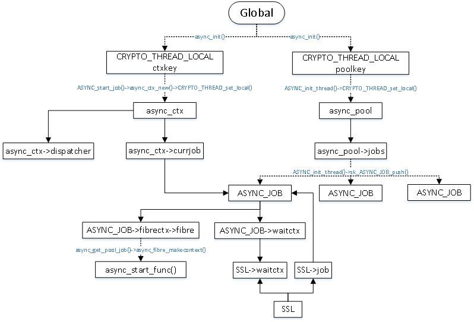

# Chapter 1 ASYNC

## 1.1 Async mode的功能

Asyn mode是OpenSSL支持异步I/O（AIO）的模式，在这个模式下openssl把硬件加速卡等不占用cpu的操作剥离出来，单独交给一个叫asyn job的结构去做。在asyn job执行的过程中，cpu可以把当前任务暂停，切换上下文（保存/恢复栈，寄存器等，用\_\_setjump, longjump实现）返回给user。User需要主动（或者等待硬件加速卡的事件通知）去poll这个async job的状态，是否是ASYNC\_FINISHED状态。如果是，说明之前的任务已经完成，则可以继续后面的操作（取回加密/解密结果）。

## 1.2 Async相关数据结构



比较重要的数据结构：

ASYNC\_JOB: fibrectx用来保存和恢复栈、寄存器；waitctx指向SSL的waitctx; job->fibrectx.fibre.uc\_stack.ss\_sp指向保存stack信息的空间，大小是STACKSIZE(32768) bytes.

async\_ctx: 全局唯一，currjob指向一个ASYNC\_JOB；dispatcher用来保存和恢复栈、寄存器，与ASYNC\_JOB的fibrectx配合使用。

## 1.3 Async mode相关API

开启Async mode可以使用：SSL\_CTX\_set\_mode(ctx, SSL\_MODE\_ASYNC)或SSL\_set\_mode(ssl, SSL\_MODE\_ASYNC)。在user调用SSL\_do\_handshake()（SSL\_read()/SSL\_write()类似）时，会调用到ssl\_start\_async\_job()：

```c
3578 int SSL_do_handshake(SSL *s)
3579 {  
3580     int ret = 1;
3581    
3582     if (s->handshake_func == NULL) {
3583         SSLerr(SSL_F_SSL_DO_HANDSHAKE, SSL_R_CONNECTION_TYPE_NOT_SET);
3584         return -1;
3585     }
3586    
3587     ossl_statem_check_finish_init(s, -1);
3588 
3589     s->method->ssl_renegotiate_check(s, 0);
3590     
3591     if (SSL_in_init(s) || SSL_in_before(s)) {
3592         if ((s->mode & SSL_MODE_ASYNC) && ASYNC_get_current_job() == NULL) {
3593             struct ssl_async_args args;
3594    
3595             args.s = s;
3596    
3597             ret = ssl_start_async_job(s, &args, ssl_do_handshake_intern);
3598         } else {
3599             ret = s->handshake_func(s);
3600         }
3601     }  
3602     return ret;
3603 }
```

ASYNC\_get\_current\_job()就是返回全局的async\_ctx->currjob，如果不为NULL意味着当前有一个job正在处理中，不应该在开启另外一个job；如果s->handshake\_func触发的回调函数没有再访问一个SSL连接的话，只有在多线程环境下才会进入else分支（3599行）。

ssl\_start\_async\_job()会调用ASYNC\_start\_job()函数处理job，回调函数是ssl\_do\_handshake\_intern，其实就是s->handshake\_func的简单包裹。

```c
168 int ASYNC_start_job(ASYNC_JOB **job, ASYNC_WAIT_CTX *wctx, int *ret,
169                     int (*func)(void *), void *args, size_t size)
170 {
171     async_ctx *ctx;
172 
173     if (!OPENSSL_init_crypto(OPENSSL_INIT_ASYNC, NULL))
174         return ASYNC_ERR;
175 
176     ctx = async_get_ctx();
177     if (ctx == NULL)
178         ctx = async_ctx_new();
179     if (ctx == NULL)
180         return ASYNC_ERR;
181 
182     if (*job)
183         ctx->currjob = *job;
184 
185     for (;;) {
186         if (ctx->currjob != NULL) {
187             if (ctx->currjob->status == ASYNC_JOB_STOPPING) {
188                 *ret = ctx->currjob->ret;
189                 ctx->currjob->waitctx = NULL;
190                 async_release_job(ctx->currjob);
191                 ctx->currjob = NULL;
192                 *job = NULL;
193                 return ASYNC_FINISH;
194             }
195 
196             if (ctx->currjob->status == ASYNC_JOB_PAUSING) {
197                 *job = ctx->currjob;
198                 ctx->currjob->status = ASYNC_JOB_PAUSED;
199                 ctx->currjob = NULL;
200                 return ASYNC_PAUSE;
201             }
202 
203             if (ctx->currjob->status == ASYNC_JOB_PAUSED) {
204                 ctx->currjob = *job;
205                 /* Resume previous job */
206                 if (!async_fibre_swapcontext(&ctx->dispatcher,
207                         &ctx->currjob->fibrectx, 1)) {
208                     ASYNCerr(ASYNC_F_ASYNC_START_JOB,
209                              ASYNC_R_FAILED_TO_SWAP_CONTEXT);
210                     goto err;
211                 }
212                 continue;
213             }
214 
215             /* Should not happen */
216             ASYNCerr(ASYNC_F_ASYNC_START_JOB, ERR_R_INTERNAL_ERROR);
217             async_release_job(ctx->currjob);
218             ctx->currjob = NULL;
219             *job = NULL;
220             return ASYNC_ERR;
221         }
222 
223         /* Start a new job */
224         if ((ctx->currjob = async_get_pool_job()) == NULL)
225             return ASYNC_NO_JOBS;
226 
227         if (args != NULL) {
228             ctx->currjob->funcargs = OPENSSL_malloc(size);
229             if (ctx->currjob->funcargs == NULL) {
230                 ASYNCerr(ASYNC_F_ASYNC_START_JOB, ERR_R_MALLOC_FAILURE);
231                 async_release_job(ctx->currjob);
232                 ctx->currjob = NULL;
233                 return ASYNC_ERR;
234             }
235             memcpy(ctx->currjob->funcargs, args, size);
236         } else {
237             ctx->currjob->funcargs = NULL;
238         }
239 
240         ctx->currjob->func = func;
241         ctx->currjob->waitctx = wctx;
242         if (!async_fibre_swapcontext(&ctx->dispatcher,
243                 &ctx->currjob->fibrectx, 1)) {
244             ASYNCerr(ASYNC_F_ASYNC_START_JOB, ASYNC_R_FAILED_TO_SWAP_CONTEXT);
245             goto err;
246         }
247     }
248 
249 err:
250     async_release_job(ctx->currjob);
251     ctx->currjob = NULL;
252     *job = NULL;
253     return ASYNC_ERR;
254 }
```

第一次调用时ctx->currjob为NULL，会调用async\_get\_pool\_job()申请一个job，在242-243行调用async\_fibre\_swapcontext()时会触发async\_start\_func()函数：

```c
144 void async_start_func(void)
145 {
146     ASYNC_JOB *job;       
147     async_ctx *ctx = async_get_ctx();
148 
149     while (1) {
150         /* Run the job */ 
151         job = ctx->currjob;
152         job->ret = job->func(job->funcargs);
153 
154         /* Stop the job */
155         job->status = ASYNC_JOB_STOPPING;
156         if (!async_fibre_swapcontext(&job->fibrectx,
157                                      &ctx->dispatcher, 1)) {
158             /*                       
159              * Should not happen. Getting here will close the thread...can't do
160              * much about it
161              */
162             ASYNCerr(ASYNC_F_ASYNC_START_FUNC, ASYNC_R_FAILED_TO_SWAP_CONTEXT);
163         }   
164     }   
165 }
```

152: 调用的就是ssl\_do\_handshake\_intern()函数，也就是说在切换了执行上下文后再执行handshake的实际动作；

async\_get\_pool\_job()函数负责申请和设置job->fibrectx数据结构：

```c
102 static ASYNC_JOB *async_get_pool_job(void) {
103     ASYNC_JOB *job;
104     async_pool *pool;
105 
106     pool = (async_pool *)CRYPTO_THREAD_get_local(&poolkey);
107     if (pool == NULL) {
108         /*
109          * Pool has not been initialised, so init with the defaults, i.e.
110          * no max size and no pre-created jobs
111          */
112         if (ASYNC_init_thread(0, 0) == 0)
113             return NULL;  
114         pool = (async_pool *)CRYPTO_THREAD_get_local(&poolkey);
115     }
116 
117     job = sk_ASYNC_JOB_pop(pool->jobs);
118     if (job == NULL) {    
119         /* Pool is empty */
120         if ((pool->max_size != 0) && (pool->curr_size >= pool->max_size))
121             return NULL;  
122 
123         job = async_job_new();
124         if (job != NULL) {
125             if (! async_fibre_makecontext(&job->fibrectx)) {
126                 async_job_free(job);       
127                 return NULL;
128             }             
129             pool->curr_size++;
130         }
131     }
132     return job;
133 }
```

125: async\_fibre\_makecontext()函数有两个关键步骤：

```c
 35 int async_fibre_makecontext(async_fibre *fibre)
 36 {           
 37     fibre->env_init = 0;
 38     if (getcontext(&fibre->fibre) == 0) {
 39         fibre->fibre.uc_stack.ss_sp = OPENSSL_malloc(STACKSIZE);
 40         if (fibre->fibre.uc_stack.ss_sp != NULL) {
 41             fibre->fibre.uc_stack.ss_size = STACKSIZE;
 42             fibre->fibre.uc_link = NULL;
 43             makecontext(&fibre->fibre, async_start_func, 0);
 44             return 1;
 45         }
 46     } else {
 47         fibre->fibre.uc_stack.ss_sp = NULL;
 48     }       
 49     return 0;   
 50 }  
```

39-41行设置stack缓存空间；

43行设置async\_start\_func()为切换stack之后触发的函数。

在调用到密码算法相关函数（如：RSA 加密/解密）时，这个操作需要提交硬件加速卡来执行，提交请求完毕后需要等待硬件返回结果，这时需要调用ASYNC\_pause\_job()函数来结束本次SSL\_do\_handshake()的调用：

```c
255 int ASYNC_pause_job(void)
256 {
257     ASYNC_JOB *job;
258     async_ctx *ctx = async_get_ctx();
259 
260     if (ctx == NULL
261             || ctx->currjob == NULL
262             || ctx->blocked) {
263         /*
264          * Could be we've deliberately not been started within a job so this is
265          * counted as success.
266          */
267         return 1;
268     }
269 
270     job = ctx->currjob;
271     job->status = ASYNC_JOB_PAUSING;
272 
273     if (!async_fibre_swapcontext(&job->fibrectx,
274                                  &ctx->dispatcher, 1)) {
275         ASYNCerr(ASYNC_F_ASYNC_PAUSE_JOB, ASYNC_R_FAILED_TO_SWAP_CONTEXT);
276         return 0;
277     }
278     /* Reset counts of added and deleted fds */
279     async_wait_ctx_reset_counts(job->waitctx);
280 
281     return 1;
282 }
```

执行到273-274行时，保存当前上下文（async\_start\_func()函数），返回到ASYNC\_start\_job()的242-243行，然后在200行返回。

当硬件加速卡完成任务，通知user之后，user会再次调用SSL\_do\_handshake()，同样还会进入到ASYNC\_start\_job()这时会进入203行这个分支，并在206行调用async\_fibre\_swapcontext()时切换到之前保存的async\_start\_func()函数的152行（即s->handshake\_func）函数内部调用的ASYNC\_pause\_job()函数的273-274行，然后执行279行并退出这个函数，取回硬件加密/解密的结果，执行后续处理（构建handshake消息等）；接下来async\_start\_func()函数的152行结束在156-157行调用async\_fibre\_swapcontext()切换回ASYNC\_start\_job()函数的206-207行，最后通过187行这个分支在193行返回ASYNC\_FINISH。

总结下ASYNC\_JOB的状态变迁流程：

第一次handshake: ASYNC\_start\_job()->async\_get\_pool\_job()--->\[ASYNC\_JOB\_RUNNING]--->async\_fibre\_swapcontext()-> async\_start\_func()->ASYNC\_pause\_job()--->\[ASYNC\_JOB\_PAUSING]--->async\_fibre\_swapcontext->ASYNC\_start\_job()---> \[ASYNC\_JOB\_PAUSED]

第二次handshake: \[ASYNC\_JOB\_PAUSED]--->ASYNC\_start\_job()->async\_fibre\_swapcontext()->async\_start\_func()---> \[ASYNC\_JOB\_STOPPING]--->async\_fibre\_swapcontext()->ASYNC\_start\_job()--->return ASYNC\_FINISH

## 1.4 QAT engine ASYNC运行流程

<figure><figcaption></figcaption></figure>

本图以RSA加密解密为例，简要介绍了intel QAT engine的ASYNC mode运行流程。

1. **First call SSL\_do\_handshake()**: ASYNC\_get\_current\_job() == NULL(async\_get\_ctx() == NULL), call ssl\_start\_async\_job(), func parmeter point to ssl\_do\_handshake\_intern(); call ASYNC\_start\_job();
2. **SSL\_do\_handshake()**--->ASYNC\_start\_job(): async\_ctx\_new(); \*job == NULL;
3. **SSL\_do\_handshake()**--->ASYNC\_start\_job(): Start a new job: async\_get\_pool\_job()(call async\_fibre\_makecontext() to set async\_start\_func() as the default function to be called when swap context);
4. **SSL\_do\_handshake()**--->ASYNC\_start\_job(): set ctx->currjob->func to the func in step 1(ssl\_do\_handshake\_intern());
5. **SSL\_do\_handshake()**--->ASYNC\_start\_job(): call **async\_fibre\_swapcontext()** to start async\_start\_func();
6. **async\_start\_func()**: get the currjob, call job->func()(ssl\_do\_handshake\_intern());
7. **async\_start\_func()**--->ssl\_do\_handshake\_intern(): call s->handshake\_func()(ossl\_statem\_accept());
8. **async\_start\_func()**: ossl\_statem\_accept() call qat\_pkey\_ecx\_keygen(), and qat\_pkey\_ecx\_keygen() call ASYNC\_pause\_job() and thus pause there;
9. **async\_start\_func()**--->qat\_pkey\_ecx\_keygen(): ASYNC\_pause\_job(): job->status = ASYNC\_JOB\_PAUSING and call **async\_fibre\_swapcontext()** to back to step 5;
10. **SSL\_do\_handshake()**--->ASYNC\_start\_job(): ctx->currjob->status = ASYNC\_JOB\_PAUSED and ctx->currjob = NULL; return ASYNC\_PAUSE;
11. **SSL\_do\_handshake()**: returns SSL\_ERROR\_WANT\_ASYNC;
12. **Second call SSL\_do\_handshake()**: ASYNC\_get\_current\_job() == NULL(ctx->currjob == NULL), call ssl\_start\_async\_job()--->call ASYNC\_start\_job();
13. **SSL\_do\_handshake()**--->ASYNC\_start\_job(): ctx->currjob = s->job; ctx->currjob->status == ASYNC\_JOB\_PAUSED; call **async\_fibre\_swapcontext()** to resume to step 9;
14. **async\_start\_func()**--->qat\_pkey\_ecx\_keygen(): if qat\_crypto\_callbackFn() was called after pause and before resume, opDone->flag will be set to 1, and thus break out while(); if not, goto next pause and redo step 9;
15. **async\_start\_func()**--->qat\_pkey\_ecx\_keygen():  if break out while(), return;
16. **async\_start\_func():** job->status = ASYNC\_JOB\_STOPPING; call **async\_fibre\_swapcontext()** to switch to step 13;
17. **SSL\_do\_handshake()**--->ASYNC\_start\_job(): async\_release\_job(ctx->currjob); ctx->currjob = NULL; s->job = NULL; return ASYNC\_FINISH;
18. SSL\_do\_handshake() return, this ASYNC process ends.

## 1.5 Job和stack资源释放

在执行上述异步操作流程的过程中申请了32768 bytes大小的内存用于存储stack信息：

```c
int async_fibre_makecontext(async_fibre *fibre)
{
#ifndef USE_SWAPCONTEXT
    fibre->env_init = 0;
#endif
    if (getcontext(&fibre->fibre) == 0) {
        fibre->fibre.uc_stack.ss_sp = OPENSSL_malloc(STACKSIZE);
        if (fibre->fibre.uc_stack.ss_sp != NULL) {
            fibre->fibre.uc_stack.ss_size = STACKSIZE;
            fibre->fibre.uc_link = NULL;
            makecontext(&fibre->fibre, async_start_func, 0); 
            return 1;
        }   
    } else {
        fibre->fibre.uc_stack.ss_sp = NULL;
    }   
    return 0;
}
```

它的释放是在async\_fibre\_free():

```c
void async_fibre_free(async_fibre *fibre)
{
    OPENSSL_free(fibre->fibre.uc_stack.ss_sp);
    fibre->fibre.uc_stack.ss_sp = NULL;
}
```

调用这个函数的只有一处：

```c
 95 static void async_job_free(ASYNC_JOB *job)
 96 {
 97     if (job != NULL) {
 98         OPENSSL_free(job->funcargs);
 99         async_fibre_free(&job->fibrectx);
100         OPENSSL_free(job);
101     }
102 }
```

可见stack资源是与job资源一起释放的，它们的lifetime是一样的。

真正调用async\_job\_free()来释放job的所有资源的也只有一处：

```c
320 static void async_empty_pool(async_pool *pool)
321 {
322     ASYNC_JOB *job;
323 
324     if (pool == NULL || pool->jobs == NULL)
325         return;
326 
327     do {
328         job = sk_ASYNC_JOB_pop(pool->jobs);
329         async_job_free(job);
330     } while (job);
331 }
...
413 static void async_delete_thread_state(void *arg)
414 {
415     async_pool *pool = (async_pool *)CRYPTO_THREAD_get_local(&poolkey);
416 
417     if (pool != NULL) {
418         async_empty_pool(pool);
419         sk_ASYNC_JOB_free(pool->jobs);
420         OPENSSL_free(pool);
421         CRYPTO_THREAD_set_local(&poolkey, NULL);
422     }
423     async_local_cleanup();
424     async_ctx_free();
425 }
426 
427 void ASYNC_cleanup_thread(void)
428 {
429     if (!OPENSSL_init_crypto(OPENSSL_INIT_ASYNC, NULL))
430         return;
431 
432     async_delete_thread_state(NULL);
433 }
```

App可以通过调用ASYNC\_cleanup\_thread()来释放所有job资源；还有一种情况可以调用ASYNC\_cleanup\_thread():

```c
 35 static async_ctx *async_ctx_new(void) 
 36 {
 37     async_ctx *nctx;
 38 
 39     if (!ossl_init_thread_start(NULL, NULL, async_delete_thread_state))
 40         return NULL;      
 41                           
 42     nctx = OPENSSL_malloc(sizeof(*nctx)); 
 43     if (nctx == NULL) {
 44         ERR_raise(ERR_LIB_ASYNC, ERR_R_MALLOC_FAILURE);
 45         goto err;
 46     }
 47 
 48     async_fibre_init_dispatcher(&nctx->dispatcher);
 49     nctx->currjob = NULL;
 50     nctx->blocked = 0;
 51     if (!CRYPTO_THREAD_set_local(&ctxkey, nctx))
 52         goto err;
 53 
 54     return nctx;
 55 err:
 56     OPENSSL_free(nctx);
 57 
 58     return NULL;
 59 }
```

39: ossl\_init\_thread\_start()设置了async\_delete\_thread\_state()作为处理函数:

```c
365 int ossl_init_thread_start(const void *index, void *arg,
366                            OSSL_thread_stop_handler_fn handfn)
367 {
368     THREAD_EVENT_HANDLER **hands;
369     THREAD_EVENT_HANDLER *hand;
370 #ifdef FIPS_MODULE
371     OSSL_LIB_CTX *ctx = arg;
372 
373     /*
374      * In FIPS mode the list of THREAD_EVENT_HANDLERs is unique per combination
375      * of OSSL_LIB_CTX and thread. This is because in FIPS mode each
376      * OSSL_LIB_CTX gets informed about thread stop events individually.
377      */
378     CRYPTO_THREAD_LOCAL *local
379         = ossl_lib_ctx_get_data(ctx, OSSL_LIB_CTX_THREAD_EVENT_HANDLER_INDEX);
380 #else
381     /*
382      * Outside of FIPS mode the list of THREAD_EVENT_HANDLERs is unique per
383      * thread, but may hold multiple OSSL_LIB_CTXs. We only get told about
384      * thread stop events globally, so we have to ensure all affected
385      * OSSL_LIB_CTXs are informed.
386      */
387     CRYPTO_THREAD_LOCAL *local = &destructor_key.value;
388 #endif
389 
390     hands = init_get_thread_local(local, 1, 0);
391     if (hands == NULL)
392         return 0;
393 
394 #ifdef FIPS_MODULE
395     if (*hands == NULL) {
396         /*
397          * We've not yet registered any handlers for this thread. We need to get
398          * libcrypto to tell us about later thread stop events. c_thread_start
399          * is a callback to libcrypto defined in fipsprov.c
400          */
401         if (!ossl_thread_register_fips(ctx))
402             return 0;
403     }
404 #endif
405 
406     hand = OPENSSL_malloc(sizeof(*hand));
407     if (hand == NULL)
408         return 0;
409 
410     hand->handfn = handfn;
411     hand->arg = arg;
412 #ifndef FIPS_MODULE
413     hand->index = index;
414 #endif
415     hand->next = *hands;
416     *hands = hand;
417 
418     return 1;
419 }
```

410: handfn会在init\_thread\_stop()中调用：

```c
322 static void init_thread_stop(void *arg, THREAD_EVENT_HANDLER **hands)
323 {   
324     THREAD_EVENT_HANDLER *curr, *prev = NULL, *tmp;
325 #ifndef FIPS_MODULE
326     GLOBAL_TEVENT_REGISTER *gtr;
327 #endif
328     
329     /* Can't do much about this */
330     if (hands == NULL)
331         return;
332 
333 #ifndef FIPS_MODULE
334     gtr = get_global_tevent_register();
335     if (gtr == NULL)
336         return;
337     
338     if (!CRYPTO_THREAD_write_lock(gtr->lock))
339         return;
340 #endif
341     
342     curr = *hands; 
343     while (curr != NULL) { 
344         if (arg != NULL && curr->arg != arg) {
345             prev = curr;
346             curr = curr->next;
347             continue;
348         }
349         curr->handfn(curr->arg);
350         if (prev == NULL)
351             *hands = curr->next;
352         else
353             prev->next = curr->next;
354         
355         tmp = curr;
356         curr = curr->next;
357         
358         OPENSSL_free(tmp);
359     }
360 #ifndef FIPS_MODULE
361     CRYPTO_THREAD_unlock(gtr->lock);
362 #endif
363 }
```

init\_thread\_stop()会在很多线程退出的相关函数中调用；不再展开。

重点说下job资源. Job资源是全局的，在进程运行过程中不断进行Async相关操作，job是如何管理的呢？

ASYNC\_start\_job()会调用async\_get\_pool\_job()申请一个新job:

```c
104 static ASYNC_JOB *async_get_pool_job(void) { 
105     ASYNC_JOB *job;       
106     async_pool *pool;     
107 
108     pool = (async_pool *)CRYPTO_THREAD_get_local(&poolkey);                                                                                                                                                                          
109     if (pool == NULL) {   
110         /*
111          * Pool has not been initialised, so init with the defaults, i.e.
112          * no max size and no pre-created jobs                                                                                                                                                                                       
113          */               
114         if (ASYNC_init_thread(0, 0) == 0)  
115             return NULL;
116         pool = (async_pool *)CRYPTO_THREAD_get_local(&poolkey);                                                                                                                                                                      
117     }
118 
119     job = sk_ASYNC_JOB_pop(pool->jobs);
120     if (job == NULL) {
121         /* Pool is empty */
122         if ((pool->max_size != 0) && (pool->curr_size >= pool->max_size))                                                                                                                                                            
123             return NULL;
124 
125         job = async_job_new();
126         if (job != NULL) {
127             if (! async_fibre_makecontext(&job->fibrectx)) {
128                 async_job_free(job);           
129                 return NULL;
130             }
131             pool->curr_size++;
132         }
133     }
134     return job;
135 }
```

119: 如果local pool中有现成的job，则pop出一个；

125: 如果没有就调用async\_job\_new()申请一个；

131: 将来这个新申请的job还会被add回pool, 所以curr\_size先+一个；

ASYNC\_start\_job()中如果返回ASYNC\_FINISH或ASYNC\_ERR之前会调用async\_release\_job():

```c
137 static void async_release_job(ASYNC_JOB *job) {
138     async_pool *pool;
139 
140     pool = (async_pool *)CRYPTO_THREAD_get_local(&poolkey);
141     if (pool == NULL) {
142         ERR_raise(ERR_LIB_ASYNC, ERR_R_INTERNAL_ERROR);
143         return;
144     }
145     OPENSSL_free(job->funcargs);
146     job->funcargs = NULL;
147     sk_ASYNC_JOB_push(pool->jobs, job);
148 }
```

147: 将job加回到pool中以便下次使用。

可见job及其相关资源会一直保持在全局的pool中，不用考虑释放除非进程/线程退出。
