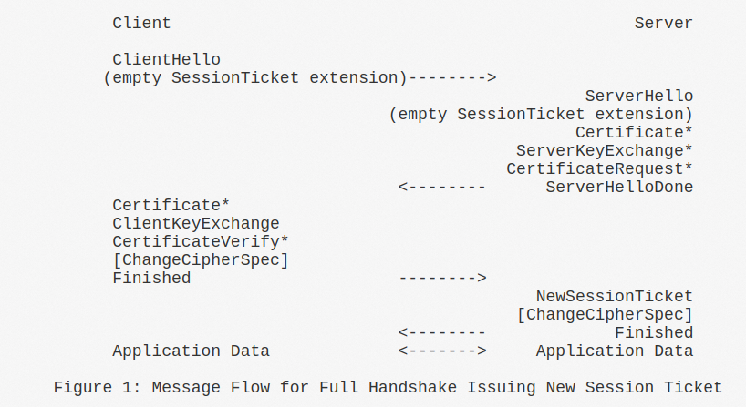
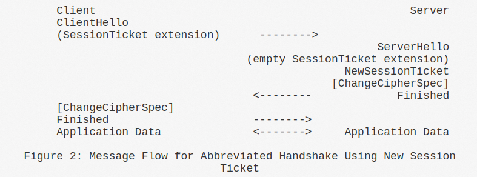

# Chapter 8 Session Resumption

## 8.1 Sample Code

TLS1.3 session reuse:

```c
    len = SSL_read(ssl, buffer, sizeof(buffer));
    if (len > 0 && strcmp(buffer, DV_TEST_RESP) == 0) {
        printf("Client接收消息成功:'%s',共%d 个字节的数据\n",
                buffer, len);
    } else {
        printf("Client消息接收失败!错误代码是%d,错误信息是'%s', len = %d\n",
                errno, strerror(errno), len);
        ret = DV_ERROR;
        goto out;
    }

    sess = SSL_get1_session(ssl);
    if (sess == NULL) {
        ERR_print_errors_fp(stderr);
	goto out;
    }
    SSL_SESSION_get0_ticket(sess, &tick, &tick_len);
    printf("tick len = %d\n", (int)tick_len);
    printf("ticket = %d\n", SSL_SESSION_has_ticket(sess));

    /* 关闭连接 */
    SSL_shutdown(ssl);
    SSL_free(ssl);
    close(sockfd);

    /* 创建一个 socket 用于 tcp 通信 */
    if ((sockfd = socket(AF_INET, SOCK_STREAM, 0)) < 0) {
        perror("Socket");
        exit(errno);
    }
    printf("socket created\n");
    printf("address created\n");
    /* 连接服务器 */
    if (connect(sockfd, (struct sockaddr *)dest, sizeof(*dest)) != 0) {
        perror("Connect ");
        exit(errno);
    }
    printf("server connected\n");
    ssl = SSL_new(ctx);
    SSL_set_session(ssl, sess);

    SSL_set_fd(ssl, sockfd);
    /* 建立 SSL 连接 */
    if (SSL_connect(ssl) == -1) {
        ERR_print_errors_fp(stderr);
        goto out;
    }

```

Client使用session reuse的方法是把Session结构体保存下来，设置到下一次的SSL连接上。

## 8.2 Session Initialize

```c
1093 int tls_construct_client_hello(SSL *s, WPACKET *pkt)
1094 {
1095     unsigned char *p;
1096     size_t sess_id_len;
1097     int i, protverr;
1098 #ifndef OPENSSL_NO_COMP
1099     SSL_COMP *comp;
1100 #endif
1101     SSL_SESSION *sess = s->session;
1102     unsigned char *session_id;
...
1110 
1111     if (sess == NULL
1112             || !ssl_version_supported(s, sess->ssl_version, NULL)
1113             || !SSL_SESSION_is_resumable(sess)) {
1114         if (s->hello_retry_request == SSL_HRR_NONE
1115                 && !ssl_get_new_session(s, 0)) {
1116             /* SSLfatal() already called */
1117             return 0;
1118         }
1119     }
...
1186     /* Session ID */
1187     session_id = s->session->session_id;
1188     if (s->new_session || s->session->ssl_version == TLS1_3_VERSION) {
1189         if (s->version == TLS1_3_VERSION
1190                 && (s->options & SSL_OP_ENABLE_MIDDLEBOX_COMPAT) != 0) {
1191             sess_id_len = sizeof(s->tmp_session_id);
1192             s->tmp_session_id_len = sess_id_len;
1193             session_id = s->tmp_session_id;
1194             if (s->hello_retry_request == SSL_HRR_NONE
1195                     && RAND_bytes_ex(s->ctx->libctx, s->tmp_session_id,
1196                                      sess_id_len, 0) <= 0) {
1197                 SSLfatal(s, SSL_AD_INTERNAL_ERROR, ERR_R_INTERNAL_ERROR);
1198                 return 0;
1199             }
1200         } else {
1201             sess_id_len = 0;
1202         }
1203     } else {
1204         assert(s->session->session_id_length <= sizeof(s->session->session_id));
1205         sess_id_len = s->session->session_id_length;
1206         if (s->version == TLS1_3_VERSION) {
1207             s->tmp_session_id_len = sess_id_len;
1208             memcpy(s->tmp_session_id, s->session->session_id, sess_id_len);
1209         }
1210     }
1211     if (!WPACKET_start_sub_packet_u8(pkt)
1212             || (sess_id_len != 0 && !WPACKET_memcpy(pkt, session_id,
1213                                                     sess_id_len))
1214             || !WPACKET_close(pkt)) {
1215         SSLfatal(s, SSL_AD_INTERNAL_ERROR, ERR_R_INTERNAL_ERROR);
1216         return 0;
1217     }
...
```

1111-1117: 如果没有设置session或session不能重用，则调用ssl\_get\_new\_session()申请一个;

1187-1218: 在ClientHello中写入Session ID字段.

```c
 424 int ssl_get_new_session(SSL *s, int session)
 425 {
 426     /* This gets used by clients and servers. */
 427             
 428     SSL_SESSION *ss = NULL;
 429         
 430     if ((ss = SSL_SESSION_new()) == NULL) {
 431         SSLfatal(s, SSL_AD_INTERNAL_ERROR, ERR_R_MALLOC_FAILURE);
 432         return 0;
 433     } 
 434 
 435     /* If the context has a default timeout, use it */
 436     if (s->session_ctx->session_timeout == 0)
 437         ss->timeout = SSL_get_default_timeout(s);
 438     else
 439         ss->timeout = s->session_ctx->session_timeout;
 440     ssl_session_calculate_timeout(ss);
 441         
 442     SSL_SESSION_free(s->session);
 443     s->session = NULL;
 444 
 445     if (session) {
 446         if (SSL_IS_TLS13(s)) {
 447             /*
 448              * We generate the session id while constructing the
 449              * NewSessionTicket in TLSv1.3.
 450              */
 451             ss->session_id_length = 0;
 452         } else if (!ssl_generate_session_id(s, ss)) {
 453             /* SSLfatal() already called */
 454             SSL_SESSION_free(ss);
 455             return 0;
 456         }
 457 
 458     } else {
 459         ss->session_id_length = 0;
 460     }
 461 
 462     if (s->sid_ctx_length > sizeof(ss->sid_ctx)) {
 463         SSLfatal(s, SSL_AD_INTERNAL_ERROR, ERR_R_INTERNAL_ERROR);
 464         SSL_SESSION_free(ss);
 465         return 0;
 466     }
 467     memcpy(ss->sid_ctx, s->sid_ctx, s->sid_ctx_length);
 468     ss->sid_ctx_length = s->sid_ctx_length;
 469     s->session = ss;
 470     ss->ssl_version = s->version;
 471     ss->verify_result = X509_V_OK;
 472 
 473     /* If client supports extended master secret set it in session */
 474     if (s->s3.flags & TLS1_FLAGS_RECEIVED_EXTMS)
 475         ss->flags |= SSL_SESS_FLAG_EXTMS;
 476 
 477     return 1;
 478 }
```

436-439: 设置session timeout值；如果s->session\_ctx->session\_timeout为0则调用SSL\_get\_default\_timeout()来设置;

```c
1762 long SSL_get_default_timeout(const SSL *s)
1763 {
1764     return s->method->get_timeout();
1765 }
```

s->session\_ctx实际上指向的是ctx, 在ctx里面session\_timeout的值也是有初始化的：

```c
3201 SSL_CTX *SSL_CTX_new_ex(OSSL_LIB_CTX *libctx, const char *propq,
3202                         const SSL_METHOD *meth)
3203 {
...
3246     ret->method = meth;
...
3250     ret->session_cache_mode = SSL_SESS_CACHE_SERVER;
3251     ret->session_cache_size = SSL_SESSION_CACHE_MAX_SIZE_DEFAULT;
3252     /* We take the system default. */
3253     ret->session_timeout = meth->get_timeout();
```

meth->get\_timeout指向tls1\_default\_timeout:

```c
2240 # define IMPLEMENT_tls_meth_func(version, flags, mask, func_name, s_accept, \
2241                                  s_connect, enc_data) \
2242 const SSL_METHOD *func_name(void)  \
2243         { \
2244         static const SSL_METHOD func_name##_data= { \
2245                 version, \
2246                 flags, \
2247                 mask, \
2248                 tls1_new, \
2249                 tls1_clear, \
2250                 tls1_free, \
2251                 s_accept, \
2252                 s_connect, \
2253                 ssl3_read, \
2254                 ssl3_peek, \
2255                 ssl3_write, \
2256                 ssl3_shutdown, \
2257                 ssl3_renegotiate, \
2258                 ssl3_renegotiate_check, \
2259                 ssl3_read_bytes, \
2260                 ssl3_write_bytes, \
2261                 ssl3_dispatch_alert, \
2262                 ssl3_ctrl, \
2263                 ssl3_ctx_ctrl, \
2264                 ssl3_get_cipher_by_char, \
2265                 ssl3_put_cipher_by_char, \
2266                 ssl3_pending, \
2267                 ssl3_num_ciphers, \
2268                 ssl3_get_cipher, \
2269                 tls1_default_timeout, \
2270                 &enc_data, \
2271                 ssl_undefined_void_function, \
2272                 ssl3_callback_ctrl, \
2273                 ssl3_ctx_callback_ctrl, \
2274         }; \
2275         return &func_name##_data; \
2276         }
```

tls1\_default\_timeout()定义：

```c
 101 long tls1_default_timeout(void)
 102 {
 103     /*
 104      * 2 hours, the 24 hours mentioned in the TLSv1 spec is way too long for
 105      * http, the cache would over fill
 106      */
 107     return (60 * 60 * 2);
 108 }
```

可以看出session的默认timeout值是2 hours.

## 8.3 Session Ticket

Client和Server可以使用Session ticket来恢复session, TLSv1.3可以使用NEW SESSION TICKET+PSK Extension来发送ticket, 其它版本则只能通过NEW SESSION TICKET消息来传递ticket.

### 8.3.1 Ticket Send

<figure><figcaption></figcaption></figure>

Session Ticket消息是由Server端在handshake完成之后发送的:

```c
3897 int tls_construct_new_session_ticket(SSL *s, WPACKET *pkt)
3898 {
3899     SSL_CTX *tctx = s->session_ctx;
3900     unsigned char tick_nonce[TICKET_NONCE_SIZE];
3901     union {
3902         unsigned char age_add_c[sizeof(uint32_t)];
3903         uint32_t age_add;
3904     } age_add_u;
3905     int ret = 0;
3906
3907     age_add_u.age_add = 0;
3908
3909     if (SSL_IS_TLS13(s)) {
3910         size_t i, hashlen;
3911         uint64_t nonce;
3912         static const unsigned char nonce_label[] = "resumption";
3913         const EVP_MD *md = ssl_handshake_md(s);
3914         int hashleni = EVP_MD_get_size(md);
3915
3916         /* Ensure cast to size_t is safe */
3917         if (!ossl_assert(hashleni >= 0)) {
3918             SSLfatal(s, SSL_AD_INTERNAL_ERROR, ERR_R_INTERNAL_ERROR);
3919             goto err;
3920         }
3921         hashlen = (size_t)hashleni;
3922
3923         /*
3924          * If we already sent one NewSessionTicket, or we resumed then
3925          * s->session may already be in a cache and so we must not modify it.
3926          * Instead we need to take a copy of it and modify that.
3927          */
3928         if (s->sent_tickets != 0 || s->hit) {
3929             SSL_SESSION *new_sess = ssl_session_dup(s->session, 0);
3930
3931             if (new_sess == NULL) {
3932                 /* SSLfatal already called */
3933                 goto err;
3934             }
3935
3936             SSL_SESSION_free(s->session);
3937             s->session = new_sess;
3938         }
3939
3940         if (!ssl_generate_session_id(s, s->session)) {
3941             /* SSLfatal() already called */
3942             goto err;
3943         }
3944         if (RAND_bytes_ex(s->ctx->libctx, age_add_u.age_add_c,
3945                           sizeof(age_add_u), 0) <= 0) {
3946             SSLfatal(s, SSL_AD_INTERNAL_ERROR, ERR_R_INTERNAL_ERROR);
3947             goto err;
3948         }
3949         s->session->ext.tick_age_add = age_add_u.age_add;
3950
3951         nonce = s->next_ticket_nonce;
3952         for (i = TICKET_NONCE_SIZE; i > 0; i--) {
3953             tick_nonce[i - 1] = (unsigned char)(nonce & 0xff);
3954             nonce >>= 8;
3955         }
3956
3957         if (!tls13_hkdf_expand(s, md, s->resumption_master_secret,
3958                                nonce_label,
3959                                sizeof(nonce_label) - 1,
3960                                tick_nonce,
3961                                TICKET_NONCE_SIZE,
3962                                s->session->master_key,
3963                                hashlen, 1)) {
3964             /* SSLfatal() already called */
3965             goto err;
3966         }
3967         s->session->master_key_length = hashlen;
3968
3969         s->session->time = time(NULL);
3970         ssl_session_calculate_timeout(s->session);
3971         if (s->s3.alpn_selected != NULL) {
3972             OPENSSL_free(s->session->ext.alpn_selected);
3973             s->session->ext.alpn_selected =
3974                 OPENSSL_memdup(s->s3.alpn_selected, s->s3.alpn_selected_len);
3975             if (s->session->ext.alpn_selected == NULL) {
3976                 s->session->ext.alpn_selected_len = 0;
3977                 SSLfatal(s, SSL_AD_INTERNAL_ERROR, ERR_R_MALLOC_FAILURE);
3978                 goto err;
3979             }
3980             s->session->ext.alpn_selected_len = s->s3.alpn_selected_len;
3981         }
3982         s->session->ext.max_early_data = s->max_early_data;
3983     }
3984
3985     if (tctx->generate_ticket_cb != NULL &&
3986         tctx->generate_ticket_cb(s, tctx->ticket_cb_data) == 0) {
3987         SSLfatal(s, SSL_AD_INTERNAL_ERROR, ERR_R_INTERNAL_ERROR);
3988         goto err;
3989     }
3990     /*
3991      * If we are using anti-replay protection then we behave as if
3992      * SSL_OP_NO_TICKET is set - we are caching tickets anyway so there
3993      * is no point in using full stateless tickets.
3994      */
3995     if (SSL_IS_TLS13(s)
3996             && ((s->options & SSL_OP_NO_TICKET) != 0
3997                 || (s->max_early_data > 0
3998                     && (s->options & SSL_OP_NO_ANTI_REPLAY) == 0))) {
3999         if (!construct_stateful_ticket(s, pkt, age_add_u.age_add, tick_nonce)) {
4000             /* SSLfatal() already called */
4001             goto err;
4002         }
4003     } else {
4004         int tmpret;
4005
4006         tmpret = construct_stateless_ticket(s, pkt, age_add_u.age_add,
4007                                             tick_nonce);
4008         if (tmpret != 1) {
4009             if (tmpret == 0) {
4010                 ret = 2; /* Non-fatal. Abort construction but continue */
4011                 /* We count this as a success so update the counts anwyay */
4012                 tls_update_ticket_counts(s);
4013             }
4014             /* else SSLfatal() already called */
4015             goto err;
4016         }
4017     }
4018
4019     if (SSL_IS_TLS13(s)) {
4020         if (!tls_construct_extensions(s, pkt,
4021                                       SSL_EXT_TLS1_3_NEW_SESSION_TICKET,
4022                                       NULL, 0)) {
4023             /* SSLfatal() already called */
4024             goto err;
4025         }
4026         tls_update_ticket_counts(s);
4027         ssl_update_cache(s, SSL_SESS_CACHE_SERVER);
4028     }
4029
4030     ret = 1;
4031  err:
4032     return ret;
4033 }
```

3909: 如果是TLSv1.3;

3928-3937: 如果已经发送过ticket或者已经恢复了session, 则去掉当前session中的ticket信息;

3940: 生成Session ID；

3944-3949: 生成age信息;

3951-3954: 填充Nonce, 作为当前连接的ticket唯一标识;

3957-3967: 更新session master key;

3969-3970: 重新计算超时时间;

3971-3980: 设置ALPN;

3982: 记录Early Data; TLSv1.3的处理结束;

3985-3987: 调用callback函数;

3995-3999: 如果是TLSv1.3并且设置了NO\_TICKET, 则构建stateful ticket(server端保存session信息用于resumption);

4003-4015: 否则构建stateless ticket，让client保存session信息以减少server的负担;

4019-4025: 如果是TLSv1.3则构建Early Data Extension，告诉对端Early Data的最大长度;

4026: 更新ticket count;

4027: 更新server session cache.

### 8.3.2 Ticket Receive

Client收到Server发送的NEW SESSION TICKET消息:

```c
2453 MSG_PROCESS_RETURN tls_process_new_session_ticket(SSL *s, PACKET *pkt)                                                                                                                                 
2454 {
2455     unsigned int ticklen;
2456     unsigned long ticket_lifetime_hint, age_add = 0;
2457     unsigned int sess_len;
2458     RAW_EXTENSION *exts = NULL;    
2459     PACKET nonce;
2460     EVP_MD *sha256 = NULL;
2461 
2462     PACKET_null_init(&nonce);
2463 
2464     if (!PACKET_get_net_4(pkt, &ticket_lifetime_hint)
2465         || (SSL_IS_TLS13(s)
2466             && (!PACKET_get_net_4(pkt, &age_add)
2467                 || !PACKET_get_length_prefixed_1(pkt, &nonce)))
2468         || !PACKET_get_net_2(pkt, &ticklen)
2469         || (SSL_IS_TLS13(s) ? (ticklen == 0 || PACKET_remaining(pkt) < ticklen)
2470                             : PACKET_remaining(pkt) != ticklen)) {
2471         SSLfatal(s, SSL_AD_DECODE_ERROR, SSL_R_LENGTH_MISMATCH);                                                                                                                                       
2472         goto err;
2473     }
2474 
2475     /*
2476      * Server is allowed to change its mind (in <=TLSv1.2) and send an empty
2477      * ticket. We already checked this TLSv1.3 case above, so it should never                                                                                                                          
2478      * be 0 here in that instance
2479      */
2480     if (ticklen == 0)
2481         return MSG_PROCESS_CONTINUE_READING;                                                                                                                                                           
2482 
2483     /*
2484      * Sessions must be immutable once they go into the session cache. Otherwise
2485      * we can get multi-thread problems. Therefore we don't "update" sessions,
2486      * we replace them with a duplicate. In TLSv1.3 we need to do this every
2487      * time a NewSessionTicket arrives because those messages arrive
2488      * post-handshake and the session may have already gone into the session
2489      * cache.
2490      */
2491     if (SSL_IS_TLS13(s) || s->session->session_id_length > 0) {
2492         SSL_SESSION *new_sess;
2493 
2494         /*
2495          * We reused an existing session, so we need to replace it with a new
2496          * one
2497          */
2498         if ((new_sess = ssl_session_dup(s->session, 0)) == 0) {
2499             SSLfatal(s, SSL_AD_INTERNAL_ERROR, ERR_R_MALLOC_FAILURE);
2500             goto err;
2501         }
2502 
2503         if ((s->session_ctx->session_cache_mode & SSL_SESS_CACHE_CLIENT) != 0
2504                 && !SSL_IS_TLS13(s)) {
2505             /*
2506              * In TLSv1.2 and below the arrival of a new tickets signals that
2507              * any old ticket we were using is now out of date, so we remove the
2508              * old session from the cache. We carry on if this fails
2509              */
2510             SSL_CTX_remove_session(s->session_ctx, s->session);
2511         }
2512 
2513         SSL_SESSION_free(s->session);
2514         s->session = new_sess;
2515     }
2516 
2517     s->session->time = time(NULL);
2518     ssl_session_calculate_timeout(s->session);
2519 
2520     OPENSSL_free(s->session->ext.tick);
2521     s->session->ext.tick = NULL;
2522     s->session->ext.ticklen = 0;
2523 
2524     s->session->ext.tick = OPENSSL_malloc(ticklen);
2525     if (s->session->ext.tick == NULL) {
2526         SSLfatal(s, SSL_AD_INTERNAL_ERROR, ERR_R_MALLOC_FAILURE);
2527         goto err;
2528     }
2529     if (!PACKET_copy_bytes(pkt, s->session->ext.tick, ticklen)) {
2530         SSLfatal(s, SSL_AD_DECODE_ERROR, SSL_R_LENGTH_MISMATCH);
2531         goto err;
2532     }
2533 
2534     s->session->ext.tick_lifetime_hint = ticket_lifetime_hint;
2535     s->session->ext.tick_age_add = age_add;
2536     s->session->ext.ticklen = ticklen;
2537 
2538     if (SSL_IS_TLS13(s)) {
2539         PACKET extpkt;
2540 
2541         if (!PACKET_as_length_prefixed_2(pkt, &extpkt)
2542                 || PACKET_remaining(pkt) != 0) {
2543             SSLfatal(s, SSL_AD_DECODE_ERROR, SSL_R_LENGTH_MISMATCH);
2544             goto err;
2545         }
2546 
2547         if (!tls_collect_extensions(s, &extpkt,
2548                                     SSL_EXT_TLS1_3_NEW_SESSION_TICKET, &exts,
2549                                     NULL, 1)
2550                 || !tls_parse_all_extensions(s,
2551                                              SSL_EXT_TLS1_3_NEW_SESSION_TICKET,
2552                                              exts, NULL, 0, 1)) {
2553             /* SSLfatal() already called */
2554             goto err;
2555         }
2556     }
2557 
2558     /*
2559      * There are two ways to detect a resumed ticket session. One is to set
2560      * an appropriate session ID and then the server must return a match in
2561      * ServerHello. This allows the normal client session ID matching to work
2562      * and we know much earlier that the ticket has been accepted. The
2563      * other way is to set zero length session ID when the ticket is
2564      * presented and rely on the handshake to determine session resumption.
2565      * We choose the former approach because this fits in with assumptions
2566      * elsewhere in OpenSSL. The session ID is set to the SHA256 hash of the
2567      * ticket.
2568      */
2569     sha256 = EVP_MD_fetch(s->ctx->libctx, "SHA2-256", s->ctx->propq);
2570     if (sha256 == NULL) {
2571         /* Error is already recorded */
2572         SSLfatal_alert(s, SSL_AD_INTERNAL_ERROR);
2573         goto err;
2574     }
2575     /*
2576      * We use sess_len here because EVP_Digest expects an int
2577      * but s->session->session_id_length is a size_t
2578      */
2579     if (!EVP_Digest(s->session->ext.tick, ticklen,
2580                     s->session->session_id, &sess_len,
2581                     sha256, NULL)) {
2582         SSLfatal(s, SSL_AD_INTERNAL_ERROR, ERR_R_EVP_LIB);
2583         goto err;
2584     }
2585     EVP_MD_free(sha256);
2586     sha256 = NULL;
2587     s->session->session_id_length = sess_len;
2588     s->session->not_resumable = 0;
2589 
2590     /* This is a standalone message in TLSv1.3, so there is no more to read */
2591     if (SSL_IS_TLS13(s)) {
2592         const EVP_MD *md = ssl_handshake_md(s);
2593         int hashleni = EVP_MD_get_size(md);
2594         size_t hashlen;
2595         static const unsigned char nonce_label[] = "resumption";
2596 
2597         /* Ensure cast to size_t is safe */
2598         if (!ossl_assert(hashleni >= 0)) {
2599             SSLfatal(s, SSL_AD_INTERNAL_ERROR, ERR_R_INTERNAL_ERROR);
2600             goto err;
2601         }
2602         hashlen = (size_t)hashleni;
2603 
2604         if (!tls13_hkdf_expand(s, md, s->resumption_master_secret,
2605                                nonce_label,
2606                                sizeof(nonce_label) - 1,
2607                                PACKET_data(&nonce),
2608                                PACKET_remaining(&nonce),
2609                                s->session->master_key,
2610                                hashlen, 1)) {
2611             /* SSLfatal() already called */
2612             goto err;
2613         }
2614         s->session->master_key_length = hashlen;
2615 
2616         OPENSSL_free(exts);
2617         ssl_update_cache(s, SSL_SESS_CACHE_CLIENT);
2618         return MSG_PROCESS_FINISHED_READING;
2619     }
2620 
2621     return MSG_PROCESS_CONTINUE_READING;
2622  err:
2623     EVP_MD_free(sha256);
2624     OPENSSL_free(exts);
2625     return MSG_PROCESS_ERROR;
2626 }
```

2464-2473: 解析NEW\_SESSION\_TICKET消息的各个字段;&#x20;

2491-2515: 如果是TLSv1.3或已经有session在重用，则复制当前的session(除了ticket的部分)到new\_sess, 并用其取代当前session; 如果是TLSv1.2或者更低版本且是CLIENT CACHE模式，则将旧的session移出cache;

2517: 更新session时间，以便检查超时;

2524-2537: 将当前ticket记录到session中;

2538-2556: 如果是TLSv1.3则处理下Early Data Extension;

2526-2584: 使用ticket生成Session ID以便在session resume的过程中让server回应相同的Session ID来表示ticket已经被接受;

2591-2614: 如果是TLSv1.3, 则更新master key;

2617: 更新client cache.

### 8.3.3 Session Resume by ticket

#### 8.3.3.1 TLSv1.2

如果client想要接收ticket, 则需要在ClientHello的Session Ticket Extension中写入0长度的ticket:

```c
 254 EXT_RETURN tls_construct_ctos_session_ticket(SSL *s, WPACKET *pkt,          
 255                                              unsigned int context, X509 *x, 
 256                                              size_t chainidx)                                                                                                                                          
 257 {
 258     size_t ticklen;
 259 
 260     if (!tls_use_ticket(s))
 261         return EXT_RETURN_NOT_SENT;                                                                                                                                                                    
 262 
 263     if (!s->new_session && s->session != NULL 
 264             && s->session->ext.tick != NULL
 265             && s->session->ssl_version != TLS1_3_VERSION) {
 266         ticklen = s->session->ext.ticklen;
 267     } else if (s->session && s->ext.session_ticket != NULL
 268                && s->ext.session_ticket->data != NULL) {
 269         ticklen = s->ext.session_ticket->length;
 270         s->session->ext.tick = OPENSSL_malloc(ticklen);
 271         if (s->session->ext.tick == NULL) {
 272             SSLfatal(s, SSL_AD_INTERNAL_ERROR, ERR_R_INTERNAL_ERROR);                                                                                                                                  
 273             return EXT_RETURN_FAIL;    
 274         }
 275         memcpy(s->session->ext.tick,          
 276                s->ext.session_ticket->data, ticklen);
 277         s->session->ext.ticklen = ticklen;
 278     } else {
 279         ticklen = 0;
 280     }
 281 
 282     if (ticklen == 0 && s->ext.session_ticket != NULL &&
 283             s->ext.session_ticket->data == NULL)
 284         return EXT_RETURN_NOT_SENT;                                                                                                                                                                    
 285 
 286     if (!WPACKET_put_bytes_u16(pkt, TLSEXT_TYPE_session_ticket)
 287             || !WPACKET_sub_memcpy_u16(pkt, s->session->ext.tick, ticklen)) {
 288         SSLfatal(s, SSL_AD_INTERNAL_ERROR, ERR_R_INTERNAL_ERROR);
 289         return EXT_RETURN_FAIL;
 290     }
 291 
 292     return EXT_RETURN_SENT;
 293 }
```

第一次会话没有session ticket，所以ticketlen是0；

Server收到ClientHello的Session Ticket Extension之后，居然除了调用一下callback之外什么都没做：

```c
 246 int tls_parse_ctos_session_ticket(SSL *s, PACKET *pkt, unsigned int context,
 247                                   X509 *x, size_t chainidx)      
 248 {
 249     if (s->ext.session_ticket_cb &&
 250             !s->ext.session_ticket_cb(s, PACKET_data(pkt),
 251                                   PACKET_remaining(pkt),         
 252                                   s->ext.session_ticket_cb_arg)) {
 253         SSLfatal(s, SSL_AD_INTERNAL_ERROR, ERR_R_INTERNAL_ERROR);
 254         return 0;
 255     }
 256 
 257     return 1;
 258 }
```

如果没有设置NO\_TICKET，server会在ServerHello中添加一个0长度的Session Ticket Extension表示它同意使用ticket:

```c
1387 EXT_RETURN tls_construct_stoc_session_ticket(SSL *s, WPACKET *pkt,
1388                                              unsigned int context, X509 *x, 
1389                                              size_t chainidx)               
1390 {
1391     if (!s->ext.ticket_expected || !tls_use_ticket(s)) {
1392         s->ext.ticket_expected = 0;    
1393         return EXT_RETURN_NOT_SENT;    
1394     }
1395 
1396     if (!WPACKET_put_bytes_u16(pkt, TLSEXT_TYPE_session_ticket)
1397             || !WPACKET_put_bytes_u16(pkt, 0)) {
1398         SSLfatal(s, SSL_AD_INTERNAL_ERROR, ERR_R_INTERNAL_ERROR);
1399         return EXT_RETURN_FAIL; 
1400     }
1401 
1402     return EXT_RETURN_SENT;
1403 }
```

Client收到这个Extension之后:

```c
1358 int tls_parse_stoc_session_ticket(SSL *s, PACKET *pkt, unsigned int context,
1359                                   X509 *x, size_t chainidx)
1360 {       
1361     if (s->ext.session_ticket_cb != NULL &&
1362         !s->ext.session_ticket_cb(s, PACKET_data(pkt),
1363                               PACKET_remaining(pkt),
1364                               s->ext.session_ticket_cb_arg)) {
1365         SSLfatal(s, SSL_AD_HANDSHAKE_FAILURE, SSL_R_BAD_EXTENSION);
1366         return 0;
1367     }
1368         
1369     if (!tls_use_ticket(s)) {
1370         SSLfatal(s, SSL_AD_UNSUPPORTED_EXTENSION, SSL_R_BAD_EXTENSION);
1371         return 0;
1372     }   
1373     if (PACKET_remaining(pkt) > 0) {
1374         SSLfatal(s, SSL_AD_DECODE_ERROR, SSL_R_BAD_EXTENSION);
1375         return 0;
1376     }
1377 
1378     s->ext.ticket_expected = 1;
1379         
1380     return 1;
1381 }
```

设置s->ext.ticket\_expected = 1作下标记.

第一次会话结束后，client保存session结构，在下一次SSL handshake开始之前将session设置到SSL结构上。这样在ClientHello的Session Ticket Extension里面就会带上ticket的值。

<figure><figcaption></figcaption></figure>

Server在处理ClientHello的时候会调用ssl\_get\_prev\_session()来恢复session:

```c
 546 /*-
 547  * ssl_get_prev attempts to find an SSL_SESSION to be used to resume this
 548  * connection. It is only called by servers.
 549  *
 550  *   hello: The parsed ClientHello data
 551  *
 552  * Returns:
 553  *   -1: fatal error
 554  *    0: no session found
 555  *    1: a session may have been found.
 556  *
 557  * Side effects:
 558  *   - If a session is found then s->session is pointed at it (after freeing an
 559  *     existing session if need be) and s->verify_result is set from the session.
 560  *   - Both for new and resumed sessions, s->ext.ticket_expected is set to 1
 561  *     if the server should issue a new session ticket (to 0 otherwise).
 562  */
 563 int ssl_get_prev_session(SSL *s, CLIENTHELLO_MSG *hello)
 564 {
 565     /* This is used only by servers. */
 566
 567     SSL_SESSION *ret = NULL;
 568     int fatal = 0;
 569     int try_session_cache = 0;
 570     SSL_TICKET_STATUS r;
 571
...
 586     } else {
 587         /* sets s->ext.ticket_expected */
 588         r = tls_get_ticket_from_client(s, hello, &ret);
 589         switch (r) {
 590         case SSL_TICKET_FATAL_ERR_MALLOC:
 591         case SSL_TICKET_FATAL_ERR_OTHER:
 592             fatal = 1;
 593             SSLfatal(s, SSL_AD_INTERNAL_ERROR, ERR_R_INTERNAL_ERROR);
 594             goto err;
 595         case SSL_TICKET_NONE:
 596         case SSL_TICKET_EMPTY:
 597             if (hello->session_id_len > 0) {
 598                 try_session_cache = 1;
 599                 ret = lookup_sess_in_cache(s, hello->session_id,
 600                                            hello->session_id_len);
 601             }
 602             break;
 603         case SSL_TICKET_NO_DECRYPT:
 604         case SSL_TICKET_SUCCESS:
 605         case SSL_TICKET_SUCCESS_RENEW:
 606             break;
 607         }
 608     }
 609
 610     if (ret == NULL)
 611         goto err;
...
 644
 645     if (sess_timedout(time(NULL), ret)) {
 646         ssl_tsan_counter(s->session_ctx, &s->session_ctx->stats.sess_timeout);
 647         if (try_session_cache) {
 648             /* session was from the cache, so remove it */
 649             SSL_CTX_remove_session(s->session_ctx, ret);
 650         }
 651         goto err;
 652     }
...
 666
 667     if (!SSL_IS_TLS13(s)) {
 668         /* We already did this for TLS1.3 */
 669         SSL_SESSION_free(s->session);
 670         s->session = ret;
 671     }
 672
 673     ssl_tsan_counter(s->session_ctx, &s->session_ctx->stats.sess_hit);
 674     s->verify_result = s->session->verify_result;
 675     return 1;
 ...
```

588: 调用tls\_get\_ticket\_from\_client()从ClientHello Session Ticket Extension中恢复session;

645-649: 检查session是否超时;

669-670: 用恢复的session取代旧session;

673: 更新计数;

674: 跳过verify.

```c
1724 /*-     
1725  * Gets the ticket information supplied by the client if any.
1726  *      
1727  *   hello: The parsed ClientHello data
1728  *   ret: (output) on return, if a ticket was decrypted, then this is set to
1729  *       point to the resulting session.
1730  */     
1731 SSL_TICKET_STATUS tls_get_ticket_from_client(SSL *s, CLIENTHELLO_MSG *hello,
1732                                              SSL_SESSION **ret)
1733 {                                
1734     size_t size;
1735     RAW_EXTENSION *ticketext;
1736 
1737     *ret = NULL;
1738     s->ext.ticket_expected = 0;
1739     
1740     /*
1741      * If tickets disabled or not supported by the protocol version
1742      * (e.g. TLSv1.3) behave as if no ticket present to permit stateful
1743      * resumption.
1744      */
1745     if (s->version <= SSL3_VERSION || !tls_use_ticket(s))
1746         return SSL_TICKET_NONE;
1747 
1748     ticketext = &hello->pre_proc_exts[TLSEXT_IDX_session_ticket];
1749     if (!ticketext->present)
1750         return SSL_TICKET_NONE;
1751 
1752     size = PACKET_remaining(&ticketext->data);
1753 
1754     return tls_decrypt_ticket(s, PACKET_data(&ticketext->data), size,
1755                               hello->session_id, hello->session_id_len, ret);
1756 }
```

以上步骤完成后，Client和Server的handshake就可以跳过Certificate的认证和密钥协商直接进行通信.

#### 8.3.3.2 TLSv1.3

在TLSv1.3中ClientHello使用PSK Extension来发送ticket:

```c
 973 EXT_RETURN tls_construct_ctos_psk(SSL *s, WPACKET *pkt, unsigned int context,
 974                                   X509 *x, size_t chainidx)
 975 {
 976 #ifndef OPENSSL_NO_TLS1_3
 977     uint32_t agesec, agems = 0;
 978     size_t reshashsize = 0, pskhashsize = 0, binderoffset, msglen;
 979     unsigned char *resbinder = NULL, *pskbinder = NULL, *msgstart = NULL;
 980     const EVP_MD *handmd = NULL, *mdres = NULL, *mdpsk = NULL;
 981     int dores = 0;
 982
 983     s->ext.tick_identity = 0;
 984
 985     /*
 986      * Note: At this stage of the code we only support adding a single
 987      * resumption PSK. If we add support for multiple PSKs then the length
 988      * calculations in the padding extension will need to be adjusted.
 989      */
 990
 991     /*
 992      * If this is an incompatible or new session then we have nothing to resume
 993      * so don't add this extension.
 994      */
 995     if (s->session->ssl_version != TLS1_3_VERSION
 996             || (s->session->ext.ticklen == 0 && s->psksession == NULL))
 997         return EXT_RETURN_NOT_SENT;
 998
 999     if (s->hello_retry_request == SSL_HRR_PENDING)
1000         handmd = ssl_handshake_md(s);
1001
1002     if (s->session->ext.ticklen != 0) {
1003         /* Get the digest associated with the ciphersuite in the session */
1004         if (s->session->cipher == NULL) {
1005             SSLfatal(s, SSL_AD_INTERNAL_ERROR, ERR_R_INTERNAL_ERROR);
1006             return EXT_RETURN_FAIL;
1007         }
1008         mdres = ssl_md(s->ctx, s->session->cipher->algorithm2);
1009         if (mdres == NULL) {
1010             /*
1011              * Don't recognize this cipher so we can't use the session.
1012              * Ignore it
1013              */
1014             goto dopsksess;
1015         }
1016
1017         if (s->hello_retry_request == SSL_HRR_PENDING && mdres != handmd) {
1018             /*
1019              * Selected ciphersuite hash does not match the hash for the session
1020              * so we can't use it.
1021              */
1022             goto dopsksess;
1023         }
1024
1025         /*
1026          * Technically the C standard just says time() returns a time_t and says
1027          * nothing about the encoding of that type. In practice most
1028          * implementations follow POSIX which holds it as an integral type in
1029          * seconds since epoch. We've already made the assumption that we can do
1030          * this in multiple places in the code, so portability shouldn't be an
1031          * issue.
1032          */
1033         agesec = (uint32_t)(time(NULL) - s->session->time);
1034         /*
1035          * We calculate the age in seconds but the server may work in ms. Due to
1036          * rounding errors we could overestimate the age by up to 1s. It is
1037          * better to underestimate it. Otherwise, if the RTT is very short, when
1038          * the server calculates the age reported by the client it could be
1039          * bigger than the age calculated on the server - which should never
1040          * happen.
1041          */
1042         if (agesec > 0)
1043             agesec--;
1044
1045         if (s->session->ext.tick_lifetime_hint < agesec) {
1046             /* Ticket is too old. Ignore it. */
1047             goto dopsksess;
1048         }
1049
1050         /*
1051          * Calculate age in ms. We're just doing it to nearest second. Should be
1052          * good enough.
1053          */
1054         agems = agesec * (uint32_t)1000;
1055
1056         if (agesec != 0 && agems / (uint32_t)1000 != agesec) {
1057             /*
1058              * Overflow. Shouldn't happen unless this is a *really* old session.
1059              * If so we just ignore it.
1060              */
1061             goto dopsksess;
1062         }
1063
1064         /*
1065          * Obfuscate the age. Overflow here is fine, this addition is supposed
1066          * to be mod 2^32.
1067          */
1068         agems += s->session->ext.tick_age_add;
1069
1070         reshashsize = EVP_MD_get_size(mdres);
1071         s->ext.tick_identity++;
1072         dores = 1;
1073     }
1074
1075  dopsksess:
1076     if (!dores && s->psksession == NULL)
1077         return EXT_RETURN_NOT_SENT;
1078
1079     if (s->psksession != NULL) {
1080         mdpsk = ssl_md(s->ctx, s->psksession->cipher->algorithm2);
1081         if (mdpsk == NULL) {
1082             /*
1083              * Don't recognize this cipher so we can't use the session.
1084              * If this happens it's an application bug.
1085              */
1086             SSLfatal(s, SSL_AD_INTERNAL_ERROR, SSL_R_BAD_PSK);
1087             return EXT_RETURN_FAIL;
1088         }
1089
1090         if (s->hello_retry_request == SSL_HRR_PENDING && mdpsk != handmd) {
1091             /*
1092              * Selected ciphersuite hash does not match the hash for the PSK
1093              * session. This is an application bug.
1094              */
1095             SSLfatal(s, SSL_AD_INTERNAL_ERROR, SSL_R_BAD_PSK);
1096             return EXT_RETURN_FAIL;
1097         }
1098
1099         pskhashsize = EVP_MD_get_size(mdpsk);
1100     }
1101
1102     /* Create the extension, but skip over the binder for now */
1103     if (!WPACKET_put_bytes_u16(pkt, TLSEXT_TYPE_psk)
1104             || !WPACKET_start_sub_packet_u16(pkt)
1105             || !WPACKET_start_sub_packet_u16(pkt)) {
1106         SSLfatal(s, SSL_AD_INTERNAL_ERROR, ERR_R_INTERNAL_ERROR);
1107         return EXT_RETURN_FAIL;
1108     }
1109
1110     if (dores) {
1111         if (!WPACKET_sub_memcpy_u16(pkt, s->session->ext.tick,
1112                                            s->session->ext.ticklen)
1113                 || !WPACKET_put_bytes_u32(pkt, agems)) {
1114             SSLfatal(s, SSL_AD_INTERNAL_ERROR, ERR_R_INTERNAL_ERROR);
1115             return EXT_RETURN_FAIL;
1116         }
1117     }
1118
1119     if (s->psksession != NULL) {
1120         if (!WPACKET_sub_memcpy_u16(pkt, s->psksession_id,
1121                                     s->psksession_id_len)
1122                 || !WPACKET_put_bytes_u32(pkt, 0)) {
1123             SSLfatal(s, SSL_AD_INTERNAL_ERROR, ERR_R_INTERNAL_ERROR);
1124             return EXT_RETURN_FAIL;
1125         }
1126         s->ext.tick_identity++;
1127     }
1128
1129     if (!WPACKET_close(pkt)
1130             || !WPACKET_get_total_written(pkt, &binderoffset)
1131             || !WPACKET_start_sub_packet_u16(pkt)
1132             || (dores
1133                 && !WPACKET_sub_allocate_bytes_u8(pkt, reshashsize, &resbinder))
1134             || (s->psksession != NULL
1135                 && !WPACKET_sub_allocate_bytes_u8(pkt, pskhashsize, &pskbinder))
1136             || !WPACKET_close(pkt)
1137             || !WPACKET_close(pkt)
1138             || !WPACKET_get_total_written(pkt, &msglen)
1139                /*
1140                 * We need to fill in all the sub-packet lengths now so we can
1141                 * calculate the HMAC of the message up to the binders
1142                 */
1143             || !WPACKET_fill_lengths(pkt)) {
1144         SSLfatal(s, SSL_AD_INTERNAL_ERROR, ERR_R_INTERNAL_ERROR);
1145         return EXT_RETURN_FAIL;
1146     }
1147
1148     msgstart = WPACKET_get_curr(pkt) - msglen;
1149
1150     if (dores
1151             && tls_psk_do_binder(s, mdres, msgstart, binderoffset, NULL,
1152                                  resbinder, s->session, 1, 0) != 1) {
1153         /* SSLfatal() already called */
1154         return EXT_RETURN_FAIL;
1155     }
1156
1157     if (s->psksession != NULL
1158             && tls_psk_do_binder(s, mdpsk, msgstart, binderoffset, NULL,
1159                                  pskbinder, s->psksession, 1, 1) != 1) {
1160         /* SSLfatal() already called */
1161         return EXT_RETURN_FAIL;
1162     }
1163
1164     return EXT_RETURN_SENT;
1165 #else
1166     return EXT_RETURN_NOT_SENT;
1167 #endif
1168 }
```

1003-1072: 检查当前的ticket, 如果超时则忽略它;

1103-1105: 写入PSK Extension头;

1110-1113: 如果有ticket则写入;

1129-1143: 写入PSK Extension其它部分并预留出binder的空间. Binder被server用来认证ticket;

1150-1159: 生成binder.

Server在调用ssl\_get\_prev\_session()时会解析PSK Extension来恢复session:

```c
 563 int ssl_get_prev_session(SSL *s, CLIENTHELLO_MSG *hello)
 564 {
 565     /* This is used only by servers. */
 566
 567     SSL_SESSION *ret = NULL;
 568     int fatal = 0;
 569     int try_session_cache = 0;
 570     SSL_TICKET_STATUS r;
 571
 572     if (SSL_IS_TLS13(s)) {
 573         /*
 574          * By default we will send a new ticket. This can be overridden in the
 575          * ticket processing.
 576          */
 577         s->ext.ticket_expected = 1;
 578         if (!tls_parse_extension(s, TLSEXT_IDX_psk_kex_modes,
 579                                  SSL_EXT_CLIENT_HELLO, hello->pre_proc_exts,
 580                                  NULL, 0)
 581                 || !tls_parse_extension(s, TLSEXT_IDX_psk, SSL_EXT_CLIENT_HELLO,
 582                                         hello->pre_proc_exts, NULL, 0))
 583             return -1;
 584
 585         ret = s->session;
 586     } else {
 ...
```

解析PSK Extension:

```c
 977 int tls_parse_ctos_psk(SSL *s, PACKET *pkt, unsigned int context, X509 *x,
 978                        size_t chainidx)
 979 {
 980     PACKET identities, binders, binder;
 981     size_t binderoffset, hashsize;
 982     SSL_SESSION *sess = NULL;
 983     unsigned int id, i, ext = 0;
 984     const EVP_MD *md = NULL;
 985
 986     /*
 987      * If we have no PSK kex mode that we recognise then we can't resume so
 988      * ignore this extension
 989      */
 990     if ((s->ext.psk_kex_mode
 991             & (TLSEXT_KEX_MODE_FLAG_KE | TLSEXT_KEX_MODE_FLAG_KE_DHE)) == 0)
 992         return 1;
 993
 994     if (!PACKET_get_length_prefixed_2(pkt, &identities)) {
 995         SSLfatal(s, SSL_AD_DECODE_ERROR, SSL_R_BAD_EXTENSION);
 996         return 0;
 997     }
 998
 999     s->ext.ticket_expected = 0;
1000     for (id = 0; PACKET_remaining(&identities) != 0; id++) {
1001         PACKET identity;
1002         unsigned long ticket_agel;
1003         size_t idlen;
1004
1005         if (!PACKET_get_length_prefixed_2(&identities, &identity)
1006                 || !PACKET_get_net_4(&identities, &ticket_agel)) {
1007             SSLfatal(s, SSL_AD_DECODE_ERROR, SSL_R_BAD_EXTENSION);
1008             return 0;
1009         }
1010
1011         idlen = PACKET_remaining(&identity);
1012         if (s->psk_find_session_cb != NULL
1013                 && !s->psk_find_session_cb(s, PACKET_data(&identity), idlen,
1014                                            &sess)) {
1015             SSLfatal(s, SSL_AD_INTERNAL_ERROR, SSL_R_BAD_EXTENSION);
1016             return 0;
1017         }
1018
1019 #ifndef OPENSSL_NO_PSK
1020         if(sess == NULL
1021                 && s->psk_server_callback != NULL
1022                 && idlen <= PSK_MAX_IDENTITY_LEN) {
1023             char *pskid = NULL;
1024             unsigned char pskdata[PSK_MAX_PSK_LEN];
1025             unsigned int pskdatalen;
1026
1027             if (!PACKET_strndup(&identity, &pskid)) {
1028                 SSLfatal(s, SSL_AD_INTERNAL_ERROR, ERR_R_INTERNAL_ERROR);
1029                 return 0;
1030             }
1031             pskdatalen = s->psk_server_callback(s, pskid, pskdata,
1032                                                 sizeof(pskdata));
1033             OPENSSL_free(pskid);
1034             if (pskdatalen > PSK_MAX_PSK_LEN) {
1035                 SSLfatal(s, SSL_AD_INTERNAL_ERROR, ERR_R_INTERNAL_ERROR);
1036                 return 0;
1037             } else if (pskdatalen > 0) {
1038                 const SSL_CIPHER *cipher;
1039                 const unsigned char tls13_aes128gcmsha256_id[] = { 0x13, 0x01 };
1040
1041                 /*
1042                  * We found a PSK using an old style callback. We don't know
1043                  * the digest so we default to SHA256 as per the TLSv1.3 spec
1044                  */
1045                 cipher = SSL_CIPHER_find(s, tls13_aes128gcmsha256_id);
1046                 if (cipher == NULL) {
1047                     OPENSSL_cleanse(pskdata, pskdatalen);
1048                     SSLfatal(s, SSL_AD_INTERNAL_ERROR, ERR_R_INTERNAL_ERROR);
1049                     return 0;
1050                 }
1051
1052                 sess = SSL_SESSION_new();
1053                 if (sess == NULL
1054                         || !SSL_SESSION_set1_master_key(sess, pskdata,
1055                                                         pskdatalen)
1056                         || !SSL_SESSION_set_cipher(sess, cipher)
1057                         || !SSL_SESSION_set_protocol_version(sess,
1058                                                              TLS1_3_VERSION)) {
1059                     OPENSSL_cleanse(pskdata, pskdatalen);
1060                     SSLfatal(s, SSL_AD_INTERNAL_ERROR, ERR_R_INTERNAL_ERROR);
1061                     goto err;
1062                 }
1063                 OPENSSL_cleanse(pskdata, pskdatalen);
1064             }
1065         }
1066 #endif /* OPENSSL_NO_PSK */
1067
1068         if (sess != NULL) {
1069             /* We found a PSK */
1070             SSL_SESSION *sesstmp = ssl_session_dup(sess, 0);
1071
1072             if (sesstmp == NULL) {
1073                 SSLfatal(s, SSL_AD_INTERNAL_ERROR, ERR_R_INTERNAL_ERROR);
1074                 return 0;
1075             }
1076             SSL_SESSION_free(sess);
1077             sess = sesstmp;
1078
1079             /*
1080              * We've just been told to use this session for this context so
1081              * make sure the sid_ctx matches up.
1082              */
1083             memcpy(sess->sid_ctx, s->sid_ctx, s->sid_ctx_length);
1084             sess->sid_ctx_length = s->sid_ctx_length;
1085             ext = 1;
1086             if (id == 0)
1087                 s->ext.early_data_ok = 1;
1088             s->ext.ticket_expected = 1;
1089         } else {
1090             uint32_t ticket_age = 0, agesec, agems;
1091             int ret;
1092
1093             /*
1094              * If we are using anti-replay protection then we behave as if
1095              * SSL_OP_NO_TICKET is set - we are caching tickets anyway so there
1096              * is no point in using full stateless tickets.
1097              */
1098             if ((s->options & SSL_OP_NO_TICKET) != 0
1099                     || (s->max_early_data > 0
1100                         && (s->options & SSL_OP_NO_ANTI_REPLAY) == 0))
1101                 ret = tls_get_stateful_ticket(s, &identity, &sess);
1102             else
1103                 ret = tls_decrypt_ticket(s, PACKET_data(&identity),
1104                                          PACKET_remaining(&identity), NULL, 0,
1105                                          &sess);
1106
1107             if (ret == SSL_TICKET_EMPTY) {
1108                 SSLfatal(s, SSL_AD_DECODE_ERROR, SSL_R_BAD_EXTENSION);
1109                 return 0;
1110             }
1111
1112             if (ret == SSL_TICKET_FATAL_ERR_MALLOC
1113                     || ret == SSL_TICKET_FATAL_ERR_OTHER) {
1114                 SSLfatal(s, SSL_AD_INTERNAL_ERROR, ERR_R_INTERNAL_ERROR);
1115                 return 0;
1116             }
1117             if (ret == SSL_TICKET_NONE || ret == SSL_TICKET_NO_DECRYPT)
1118                 continue;
1119
1120             /* Check for replay */
1121             if (s->max_early_data > 0
1122                     && (s->options & SSL_OP_NO_ANTI_REPLAY) == 0
1123                     && !SSL_CTX_remove_session(s->session_ctx, sess)) {
1124                 SSL_SESSION_free(sess);
1125                 sess = NULL;
1126                 continue;
1127             }
1128
1129             ticket_age = (uint32_t)ticket_agel;
1130             agesec = (uint32_t)(time(NULL) - sess->time);
1131             agems = agesec * (uint32_t)1000;
1132             ticket_age -= sess->ext.tick_age_add;
1133
1134             /*
1135              * For simplicity we do our age calculations in seconds. If the
1136              * client does it in ms then it could appear that their ticket age
1137              * is longer than ours (our ticket age calculation should always be
1138              * slightly longer than the client's due to the network latency).
1139              * Therefore we add 1000ms to our age calculation to adjust for
1140              * rounding errors.
1141              */
1142             if (id == 0
1143                     && sess->timeout >= (long)agesec
1144                     && agems / (uint32_t)1000 == agesec
1145                     && ticket_age <= agems + 1000
1146                     && ticket_age + TICKET_AGE_ALLOWANCE >= agems + 1000) {
1147                 /*
1148                  * Ticket age is within tolerance and not expired. We allow it
1149                  * for early data
1150                  */
1151                 s->ext.early_data_ok = 1;
1152             }
1153         }
1154
1155         md = ssl_md(s->ctx, sess->cipher->algorithm2);
1156         if (md == NULL) {
1157             SSLfatal(s, SSL_AD_INTERNAL_ERROR, ERR_R_INTERNAL_ERROR);
1158             goto err;
1159         }
1160         if (!EVP_MD_is_a(md,
1161                 EVP_MD_get0_name(ssl_md(s->ctx,
1162                                         s->s3.tmp.new_cipher->algorithm2)))) {
1163             /* The ciphersuite is not compatible with this session. */
1164             SSL_SESSION_free(sess);
1165             sess = NULL;
1166             s->ext.early_data_ok = 0;
1167             s->ext.ticket_expected = 0;
1168             continue;
1169         }
1170         break;
1171     }
1172
1173     if (sess == NULL)
1174         return 1;
1175
1176     binderoffset = PACKET_data(pkt) - (const unsigned char *)s->init_buf->data;
1177     hashsize = EVP_MD_get_size(md);
1178
1179     if (!PACKET_get_length_prefixed_2(pkt, &binders)) {
1180         SSLfatal(s, SSL_AD_DECODE_ERROR, SSL_R_BAD_EXTENSION);
1181         goto err;
1182     }
1183
1184     for (i = 0; i <= id; i++) {
1185         if (!PACKET_get_length_prefixed_1(&binders, &binder)) {
1186             SSLfatal(s, SSL_AD_DECODE_ERROR, SSL_R_BAD_EXTENSION);
1187             goto err;
1188         }
1189     }
1190
1191     if (PACKET_remaining(&binder) != hashsize) {
1192         SSLfatal(s, SSL_AD_DECODE_ERROR, SSL_R_BAD_EXTENSION);
1193         goto err;
1194     }
1195     if (tls_psk_do_binder(s, md, (const unsigned char *)s->init_buf->data,
1196                           binderoffset, PACKET_data(&binder), NULL, sess, 0,
1197                           ext) != 1) {
1198         /* SSLfatal() already called */
1199         goto err;
1200     }
1201
1202     s->ext.tick_identity = id;
1203
1204     SSL_SESSION_free(s->session);
1205     s->session = sess;
1206     return 1;
1207 err:
1208     SSL_SESSION_free(sess);
1209     return 0;
1210 }
```


## 8.4 Session ID

## 8.5 Session Cache

## 8.6 Session Resumption Test

### 8.6.1 TLSv1.3


### 8.6.2 TLSv1.2

