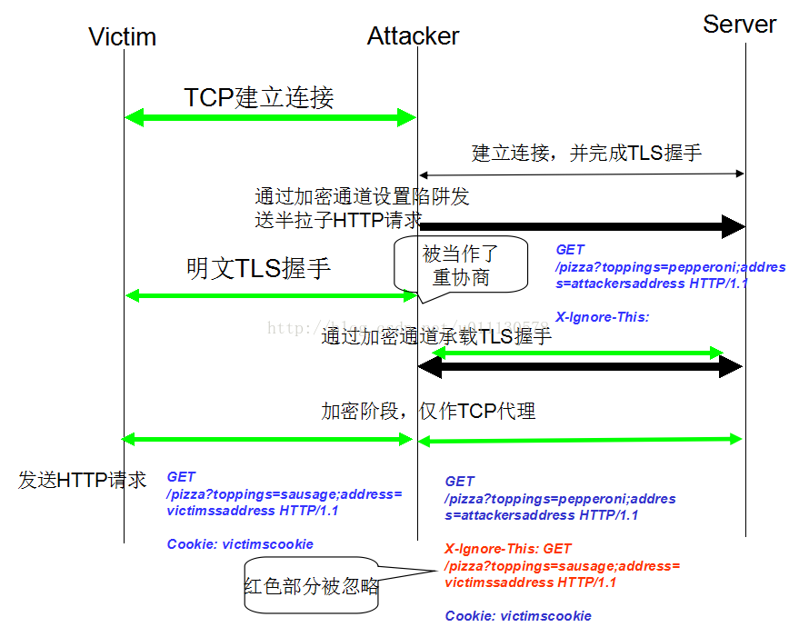

# 五、TLS Renegotiation

## 1. 什么是重协商

    大部分TLS连接都以handshake为开始，经过应用数据的交换，最后关闭会话。如果在第一次handshake之后（可能经历了应用数据的交换也可能没有）请求重新协商，就会发起一次新的handshake，对新的安全参数达成一致。重协商的handshake的消息都是全部加密的，这与第一次handshake明显不同。

    重协商功能应用场景举例：
\*\) Client证书：可以设置访问网站的根路径不要求client携带证书，而在client访问特定子区域时server发起重协商请求，要求client携带证书；
\*\) 隐藏消息：由于重协商的handshake消息是加密的，被动攻击者无法监视协商过程，这样就可以隐藏一些敏感信息（比如证书中包含的身份识别信息）。

## 2. 怎样发起重协商

    有两种方式可以发起重协商：
\*\)Client发起：TLS协议允许client在任意时间简单地发送新的ClientHello消息请求重新协商，就如同建立一个新的连接一样；
\*\)Server发起：如果server希望重新协商，它会发送HelloRequest消息给client，这个消息通知client停止发送应用数据，并开始新的handshake。

## 3. 重协商的安全性

    重协商机制并不安全，针对重协商的攻击类型如下：

### 3.1 DoS攻击

    TLS的handshake过程需要使用非对称算法进行身份认证和密钥协商，这个过程需要很多计算资源。Handshake本来只在TLS连接开始建立时执行一次，但由于重协商机制的引入，使得client被允许不断发起新的handshake。由于client可以使用较少的资源来执行handshake（比如：不检查server的证书，这样可以避免校验签名的开销），这样攻击者就可以更容易地耗尽server的资源导致其拒绝为其它用户的请求提供服务。

    这种攻击与分布式拒绝服务攻击\(DDoS\)的不同之处在于，它不需要大量的攻击来消耗网络带宽，而仅仅通过一台主机的一个TCP/IP socket来耗尽server的资源（这样就会导致当前的DoS和DDoS防御策略无效）。例如，一台server通常能执行150-300次/s握手，而一个client可以发起多达1000次/s握手请求。

    防御方法：
1\) 禁用重协商功能：不推荐，因为这样会导致依赖重协商的特性无法使用；
2\) 禁止client发起重协商：目前看来似乎是个不错的选择；
3\) 速率限制：对新到来的TLS连接和重协商的速率进行限制；
4\) 使用SSL加速卡：通过极大地提高server对handshake的处理能力来增加攻击的成本，但可能攻击者只增加一到两台主机进行攻击就可以使得此措施无效。

### 3.2 中间人攻击

由于TLS的重协商前后的两条TLS连接之间没有关联（即使它们发生在同一条TCP连接上），而且应用层（如HTTP）与加密层很少交互（例如，如果重协商发生在HTTP请求的过程中，上层应用是得不到通知的），导致TLS层面发生的事情与上层应用了解到的信息不匹配。

因此，一个中间人（man-in-the-middle，MITM）攻击者就可以通过如下步骤来利用这个漏洞：

1\) 拦截一个client到server的TCP连接，截住其TLS handshake请求；
2\) 新建一个到server的TLS连接，在handshake之后发送攻击负载；
3\) 将1\)中拦截的handshake请求通过与server的TLS连接发送过去，这样在server看来是重协商，而在client看来是一条全新的TLS连接。一旦重协商完成，client与server开始交换应用层数据，攻击者的攻击负载和client的正常数据就会被server合并处理，从而使得攻击成功。

攻击过程（举例）的示意图如下：



这种攻击会使得server执行攻击者制定的任意GET请求。

对于这种MITM攻击，即使禁止了client发起重协商，依赖于client证书校验和支持SGC的网站仍然容易遭到攻击。因为攻击者只需要调查网站在哪些情况下是需要进行重协商的，如果条件得到满足则攻击者就可以开展攻击行为。

防御方法：

1）禁用重协商功能：不推荐，除了会使得依赖重协商的特性无法使用外，还会导致增加了网络上重协商功能的不确定性，使得client无法有效保护自己【注1】

2）使用“安全重协商”功能：通过关联重协商前后的TLS连接来阻止非法数据注入；详见第四节。

【注1】：重协商的安全缺陷对client的威胁在于：攻击者可以通过控制服务器来攻击与之通信的client。由于在攻击发生时client并未参与到重协商的过程中，故对于client唯一可行的保护自己的方法就是只于支持安全重协商的server建立连接。对于禁用了重协商功能的server，client不希望自己无法连接它们，但client无法区分server是禁用了重协商还是不支持安全重协商。所以server禁用重协商的行为会导致client很难使用有效的方法来保护自己。

## 4. 安全重协商

为了解决中间人攻击的问题，【RFC5764】提出了“安全重协商”机制。本质很简单，就是关联两次握手，方式是提供了一个新的扩展（renegotiation\_info）。SSLv3/TLS 1.0不支持扩展，为了使其支持安全重协商，client需要发送**TLS\_EMPTY\_RENEGOTIATION\_INFO\_SCSV（0xFF）密码套件**（缩写为SCSV）**。**

**安全重协商的流程如下：**

1\) 在某个连接的第一次握手期间，双方通过renegotiation\_info扩展或SCSV套件通知对方自己支持安全重协商；

2\) 在handshake过程中，client和server都分别记录Finish消息之中的client\_verify\_data和server\_verify\_data；

3\)重协商时client在ClientHello中包含client\_verify\_data，server在ServerHello中包含client\_verify\_data和server\_verify\_data。对于受害者，如果协商中不会携带这些数据则连接无法建立。由于Finished消息总是加密的，攻击者无法得到client\_verify\_data和server\_verify\_data的值。

## 5. OpenSSL中的重协商（基于OpenSSL-1.1.0f）

### 5.1 发起重协商

#### 5.1.1 SSL\_renegotiate

     Client和server只需调用SSL\_renegotiate\(ssl\)函数即可完成发起重协商的设置。SSL\_renegotiate\(\)函数定义如下：
```text
1641 int SSL_renegotiate(SSL *s)
1642 {
1643     if (s->renegotiate == 0)
1644         s->renegotiate = 1;
1645
1646     s->new_session = 1; 
1647
1648     return (s->method->ssl_renegotiate(s));
1649 }
```

     对于TLS\_client\_method\(\)和TLS\_server\_method\(\)，s-&gt;method-&gt;ssl\_renegotiate指向ssl3\_renegotiate\(\)：

```text
3865 int ssl3_renegotiate(SSL *s)
3866 {
3867     if (s->handshake_func == NULL)
3868         return (1);
3869
3870     if (s->s3->flags &SSL3_FLAGS_NO_RENEGOTIATE_CIPHERS)
3871         return (0);
3872
3873     s->s3->renegotiate = 1;
3874     return (1);
3875 }
```

 可见，SSL\_renegotiate\(\)函数只是将s-&gt;s3-&gt;renegotiate设置为1而已，并不是发送重协商报文（Handshake，HelloRequest）。发送重协商报文是在SSL\_write\(\)或SSL\_read\(\)函数被调用的时候进行的：

#### 5.1.2 发送第一个消息

     先来看SSL\_write\(\)函数。对于TLS\_client\_method\(\)和TLS\_server\_method\(\)，SSL\_write\(\)最终都会调用ssl3\_write\(\)函数：

```text
3816 int ssl3_write(SSL *s, const void *buf, int len)
3817 {
3818     clear_sys_error();
3819     if (s->s3->renegotiate)
3820         ssl3_renegotiate_check(s);     
3821
3822     return s->method->ssl_write_bytes(s,SSL3_RT_APPLICATION_DATA, buf, len);
3823 }
```

     由于之前调用的SSL\_renegotiate\(\)函数将s-&gt;s3-&gt;renegotiate设置为1，故会在3820行调用到ssl3\_renegotiate\_check\(\)函数：

```text
3877 int ssl3_renegotiate_check(SSL *s)
3878 {
3879     int ret = 0;
3880
3881     if (s->s3->renegotiate) {
3882         if(!RECORD_LAYER_read_pending(&s->rlayer)
3883             &&!RECORD_LAYER_write_pending(&s->rlayer)
3884             && !SSL_in_init(s)) {         
3885             /*
3886              * if we are the server, and wehave sent a 'RENEGOTIATE'
3887              * message, we need to set thestate machine into the renegotiate
3888              * state.
3889              */
3890             ossl_statem_set_renegotiate(s);
3891             s->s3->r协商enegotiate = 0;       
3892             s->s3->num_renegotiations++;  
3893            s->s3->total_renegotiations++;
3894             ret = 1;
3895         }
3896     }
3897     return (ret);
3898 }
```

     其中的关键代码是3890行ossl\_statem\_set\_renegotiate\(\)函数：

```text
103 /*      
104  * Set the state machine up ready for arenegotiation handshake
105  */ 
106 void ossl_statem_set_renegotiate(SSL *s)
107 {
108     s->statem.state = MSG_FLOW_RENEGOTIATE;
109     s->statem.in_init = 1;
110 }
```

调用完ssl3\_renegotiate\_check\(\)函数之后，ssl3\_write\(\)会调用s-&gt;method-&gt;ssl\_write\_bytes指向的ssl3\_write\_bytes\(\)函数：

```text
343 int ssl3_write_bytes(SSL *s, int type, const void *buf_, int len)
344 {
…
379     if (SSL_in_init(s) &&!ossl_statem_get_in_handshake(s)) {
380         i = s->handshake_func(s);
381         if (i < 0)
382             return (i);
383         if (i == 0) {
384             SSLerr(SSL_F_SSL3_WRITE_BYTES,SSL_R_SSL_HANDSHAKE_FAILURE);
385             return -1;
386         }
387     }
…
```

其中SSL\_in\_init\(s\)的返回值会是1：

```text
69 int SSL_in_init(SSL *s)
70 {   
71     return s->statem.in_init;
72 }
```

     由于是在handshake结束之后调用，故ossl\_statem\_get\_in\_handshake\(s\)的返回值会是0：

```text
141 int ossl_statem_get_in_handshake(SSL *s)
142 {   
143     return s->statem.in_handshake;
144 }
```

     故ssl3\_write\_bytes\(\)会执行380行s-&gt;handshake\_func\(s\)。

     再来看SSL\_read\(\)。对于TLS\_client\_method\(\)和TLS\_server\_method\(\)，这个函数最终会调用ssl3\_read\(\)：

```text
3825 static int ssl3_read_internal(SSL *s, void *buf, int len, int peek)
3826 {  
3827     int ret;            
3828    
3829     clear_sys_error();
3830     if (s->s3->renegotiate)
3831         ssl3_renegotiate_check(s);
3832     s->s3->in_read_app_data = 1;
3833     ret =
3834         s->method->ssl_read_bytes(s,SSL3_RT_APPLICATION_DATA, NULL, buf, len,
3835                                   peek);
3836     if ((ret == -1) &&(s->s3->in_read_app_data == 2)) {
3837         /*
3838          * ssl3_read_bytes decided to calls->handshake_func, which called
3839          * ssl3_read_bytes to read handshakedata. However, ssl3_read_bytes
3840          * actually found application data andthinks that application data
3841          * makes sense here; so disablehandshake processing and try to read
3842          * application data again.
3843          */
3844         ossl_statem_set_in_handshake(s, 1);
3845         ret =
3846             s->method->ssl_read_bytes(s,SSL3_RT_APPLICATION_DATA, NULL, buf,
3847                                       len,peek);
3848         ossl_statem_set_in_handshake(s, 0);
3849     } else
3850         s->s3->in_read_app_data = 0;
3851    
3852     return (ret);
3853 }
3854
3855 int ssl3_read(SSL *s, void *buf, int len)
3856 {
3857     return ssl3_read_internal(s, buf, len, 0);
3858 }
```

     调用SSL\_renegotiate\(\)后3831行会被执行，其影响见上文对SSL\_write\(\)函数的分析。s-&gt;method-&gt;ssl\_read\_bytes\(\)指向ssl3\_read\_bytes\(\)：

```text
975 int ssl3_read_bytes(SSL *s, int type, int *recvd_type, unsigned char *buf,
976                     int len, int peek)            
977 {
…
1029     if (!ossl_statem_get_in_handshake(s)&& SSL_in_init(s)) {
1030         /* type == SSL3_RT_APPLICATION_DATA */
1031         i = s->handshake_func(s);
1032         if (i < 0)
1033             return (i);
1034         if (i == 0) {
1035             SSLerr(SSL_F_SSL3_READ_BYTES,SSL_R_SSL_HANDSHAKE_FAILURE);
1036             return (-1);
1037         }
1038     }
…
```

最后SSL\_read\(\)会执行1031行代码。可见在调用SSL\_renegotiate\(\)开启协商功能后，SSL\_write\(\)和SSL\_read\(\)都会调用s-&gt;handshake\_func\(s\)，对于client会调用到ossl\_statem\_connect：

```text
168 int ossl_statem_connect(SSL *s)
169 {
170     return state_machine(s, 0);   
171 }
```

     对于server则会调用ossl\_statem\_accept\(\)：

```text
173 int ossl_statem_accept(SSL *s)
174 {                        
175     return state_machine(s, 1);   
176 }
```

     它们都会调用state\_machine\(\)：

```text
218 static int state_machine(SSL *s, int server)
219 {
…
276     if (st->state == MSG_FLOW_UNINITED ||st->state == MSG_FLOW_RENEGOTIATE) {
277         if (st->state == MSG_FLOW_UNINITED){
278             st->hand_state =TLS_ST_BEFORE;                                                                                                                                                            
279         }
280
281         s->server = server;
…
380         st->state = MSG_FLOW_WRITING;
381         init_write_state_machine(s);
382         st->read_state_first_init = 1;
383     }
384
385     while (st->state != MSG_FLOW_FINISHED){
386         if (st->state == MSG_FLOW_READING){
387             ssret = read_state_machine(s);
388             if (ssret == SUB_STATE_FINISHED) {
389                 st->state =MSG_FLOW_WRITING;
390                 init_write_state_machine(s);
391             } else {
392                 /* NBIO or error */
393                 goto end;
394             }
395         } else if (st->state ==MSG_FLOW_WRITING) {
396             ssret = write_state_machine(s);
397             if (ssret == SUB_STATE_FINISHED) {
398                 st->state =MSG_FLOW_READING;
399                 init_read_state_machine(s);
400             } else if (ssret ==SUB_STATE_END_HANDSHAKE) {
401                 st->state =MSG_FLOW_FINISHED;
402             } else {
403                 /* NBIO or error */
404                 goto end;
405             }
406         } else {
407             /* Error */
408             ossl_statem_set_error(s);
409             goto end;
410         }
411     }
412
413     st->state = MSG_FLOW_UNINITED;
414     ret = 1;
```

     由于执行了380行，故396行write\_state\_machine\(\)会执行：

```text
704 static SUB_STATE_RETURN write_state_machine(SSL *s)
705 {
706     OSSL_STATEM *st = &s->statem;
707     int ret;
708     WRITE_TRAN(*transition) (SSL *s);
709     WORK_STATE(*pre_work) (SSL *s, WORK_STATEwst);
710     WORK_STATE(*post_work) (SSL *s, WORK_STATEwst);
711     int (*construct_message) (SSL *s);
712     void (*cb) (const SSL *ssl, int type, intval) = NULL;
713
714     cb = get_callback(s);
715
716     if (s->server) {   
717         transition =ossl_statem_server_write_transition;
718         pre_work =ossl_statem_server_pre_work;
719         post_work =ossl_statem_server_post_work;
720         construct_message =ossl_statem_server_construct_message;
721     } else {           
722         transition =ossl_statem_client_write_transition;
723         pre_work =ossl_statem_client_pre_work;
724         post_work =ossl_statem_client_post_work;
725         construct_message =ossl_statem_client_construct_message;
726     }
727                        
728     while (1) {
729         switch (st->write_state) {
730         case WRITE_STATE_TRANSITION:
731             if (cb != NULL) {
732                 /* Notify callback of an impending statechange */
733                 if (s->server)
734                     cb(s, SSL_CB_ACCEPT_LOOP,1);
735                 else
736                     cb(s, SSL_CB_CONNECT_LOOP,1);
737             }      
738             switch (transition(s)) {
739             case WRITE_TRAN_CONTINUE:
740                 st->write_state =WRITE_STATE_PRE_WORK;
741                 st->write_state_work =WORK_MORE_A;
742                 break;
743   
744             case WRITE_TRAN_FINISHED:
745                 return SUB_STATE_FINISHED;
746                 break;
747
748             default:
749                 return SUB_STATE_ERROR;
750             }
751             break;
752
753         case WRITE_STATE_PRE_WORK:
754             switch (st->write_state_work =pre_work(s, st->write_state_work)) {
755             default:
756                 return SUB_STATE_ERROR;
757
758             case WORK_FINISHED_CONTINUE:
759                 st->write_state =WRITE_STATE_SEND;
760                 break;
761
762             case WORK_FINISHED_STOP:
763                 returnSUB_STATE_END_HANDSHAKE;
764             }
765             if (construct_message(s) == 0)
766                 return SUB_STATE_ERROR;
767
768             /* Fall through */
769
770         case WRITE_STATE_SEND:
771             if (SSL_IS_DTLS(s) &&st->use_timer) {
772                 dtls1_start_timer(s);
773             }
774             ret = statem_do_write(s);
775             if (ret <= 0) {
776                 return SUB_STATE_ERROR;
777             }
778             st->write_state =WRITE_STATE_POST_WORK;
779             st->write_state_work =WORK_MORE_A;
780             /* Fall through */
781
782         case WRITE_STATE_POST_WORK:
783             switch (st->write_state_work =post_work(s, st->write_state_work)) {
784             default:
785                 return SUB_STATE_ERROR;
786
787             case WORK_FINISHED_CONTINUE:
788                 st->write_state =WRITE_STATE_TRANSITION;
789                 break;
790
791             case WORK_FINISHED_STOP:
792                 returnSUB_STATE_END_HANDSHAKE;
793             }
794             break;
795
796         default:
797             return SUB_STATE_ERROR;
798         }
799     }
800 }
```

```text
     由于state\_machine \(\)函数在381行调用了init\_write\_state\_machine\(\)，使得在write\_state\_machine\(\)函数的while循环中会从731行还是的WRITE\_STATE\_TRANSITIONcase块开始执行（状态变迁），然后顺次执行754行开始的WRITE\_STATE\_PRE\_WORK cse块（构建handshake消息），771行开始的WRITE\_STATE\_SENDcase块（发送handshake消息）,783行开始的WRITE\_STATE\_POST\_WORK case块（发送消息之后的处理工作）。然后根据状态机变迁的结果重复上述操作（安装次序发送handshake报文）。但对于第一个重协商消息\(client是ClientHello，server是HelloRequest\)，发送完毕后会跳出循环。

     这里有一个关键的问题：write\_state\_machine\(\)函数如何区分client和server并为它们发送不同的重协商消息呢？主要取决于transition函数和construct\_message函数的选择。

     对于client，transition =ossl\_statem\_client\_write\_transition：
```

```text
273 /*
 274  *client_write_transition() works out what handshake state to move to next
 275  *when the client is writing messages to be sent to the server.                                                                                                                                      
 276  */
 277 WRITE_TRAN ossl_statem_client_write_transition(SSL *s)                                                                                                                                                
 278 {
 279    OSSL_STATEM *st = &s->statem;                                                                                                                                                                     
 280
 281    switch (st->hand_state) {
 282    case TLS_ST_OK:
 283        /* Renegotiation - fall through */
 284    case TLS_ST_BEFORE:
 285        st->hand_state = TLS_ST_CW_CLNT_HELLO;
 286        return WRITE_TRAN_CONTINUE;   
...
```

在285行st-&gt;hand\_state会被设置为TLS\_ST\_CW\_CLNT\_HELLO。而construct\_message= ossl\_statem\_client\_construct\_message：

```text
 513 int ossl_statem_client_construct_message(SSL *s)
 514 {     
 515    OSSL_STATEM *st = &s->statem;
 516       
 517    switch (st->hand_state) {
 518    case TLS_ST_CW_CLNT_HELLO:
 519        return tls_construct_client_hello(s);
```

```text
     这样会使得client发送的第一个重协商消息为ClientHello。

     对于server，transition =ossl\_statem\_server\_write\_transition：
```

```text
 306 /*
 307  *server_write_transition() works out what handshake state to move to next
 308  *when the server is writing messages to be sent to the client.
 309 */   
 310 WRITE_TRAN ossl_statem_server_write_transition(SSL *s)
 311 { 
 312    OSSL_STATEM *st = &s->statem;
 313   
 314    switch (st->hand_state) {
 315    case TLS_ST_BEFORE:
 316        /* Just go straight to trying to read from the client */
 317        return WRITE_TRAN_FINISHED;
 318        
 319    case TLS_ST_OK:
 320        /* We must be trying to renegotiate */
 321        st->hand_state = TLS_ST_SW_HELLO_REQ;
 322        return WRITE_TRAN_CONTINUE;
…
```

st-&gt;hand\_state被设置为TLS\_ST\_SW\_HELLO\_REQ。对于server，construct\_message = ossl\_statem\_server\_construct\_message：

```text
 615 /*
 616  *Construct a message to be sent from the server to the client.
 617  *
 618  *Valid return values are:
 619 *   1: Success
 620 *   0: Error
 621  */
 622 int ossl_statem_server_construct_message(SSL *s)
 623 {
 624    OSSL_STATEM *st = &s->statem; 
 625
 626    switch (st->hand_state) {
 627    case DTLS_ST_SW_HELLO_VERIFY_REQUEST:
 628        return dtls_construct_hello_verify_request(s);
 629
 630    case TLS_ST_SW_HELLO_REQ:
 631        return tls_construct_hello_request(s);
…
```

```text
     所以server发送的第一个重协商消息是HelloRequest。
```

#### 5.1.3 接收重协商消息并发送后续消息

```text
     对重协商消息的接收是由SSL\_read\(\)完成的\(SSL\_write\(\)函数不能接收重协商消息\)，它接收到的是HelloRequest或ClientHello消息，对于TLS\_client\_metho\(\)和TLS\_server\_method\(\)，这个函数最终会调用ssl3\_read\_bytes\(\)：
```

```text
975 int ssl3_read_bytes(SSL *s, int type, int *recvd_type, unsigned char *buf,
976                     int len, int peek)
977 {
…
1025     /*
1026      * Now s->rlayer.handshake_fragment_len == 0 if type == SSL3_RT_HANDSHAKE.
1027      */
1028
1029     if (!ossl_statem_get_in_handshake(s) && SSL_in_init(s)) {
1030         /* type == SSL3_RT_APPLICATION_DATA */
1031         i = s->handshake_func(s);
1032         if (i < 0)
1033             return (i);
1034         if (i == 0) {
1035             SSLerr(SSL_F_SSL3_READ_BYTES, SSL_R_SSL_HANDSHAKE_FAILURE);
1036             return (-1);
1037         }
1038     }
1039  start:
1040     s->rwstate = SSL_NOTHING;
...
1260     /* If we are a client, check for an incoming 'Hello Request': */
1261     if ((!s->server) &&
1262         (s->rlayer.handshake_fragment_len >= 4) &&
1263         (s->rlayer.handshake_fragment[0] == SSL3_MT_HELLO_REQUEST) &&
1264         (s->session != NULL) && (s->session->cipher != NULL)) {
1265         s->rlayer.handshake_fragment_len = 0;
1266 
1267         if ((s->rlayer.handshake_fragment[1] != 0) ||
1268             (s->rlayer.handshake_fragment[2] != 0) ||
1269             (s->rlayer.handshake_fragment[3] != 0)) {
1270             al = SSL_AD_DECODE_ERROR;
1271             SSLerr(SSL_F_SSL3_READ_BYTES, SSL_R_BAD_HELLO_REQUEST);
1272             goto f_err;
1273         }
1274 
1275         if (s->msg_callback)
1276             s->msg_callback(0, s->version, SSL3_RT_HANDSHAKE,
1277                             s->rlayer.handshake_fragment, 4, s,
1278                             s->msg_callback_arg);
1279 
1280         if (SSL_is_init_finished(s) &&
1281             !(s->s3->flags & SSL3_FLAGS_NO_RENEGOTIATE_CIPHERS) &&
1282             !s->s3->renegotiate) {
1283             ssl3_renegotiate(s);
1284             if (ssl3_renegotiate_check(s)) {
1285                 i = s->handshake_func(s);
1286                 if (i < 0)
1287                     return (i);
...
1323     /*
1324      * If we are a server and get a client hello when renegotiation isn't
1325      * allowed send back a no renegotiation alert and carry on. WARNING:
1326      * experimental code, needs reviewing (steve)
1327      */
1328     if (s->server &&
1329         SSL_is_init_finished(s) &&
1330         !s->s3->send_connection_binding &&
1331         (s->version > SSL3_VERSION) &&
1332         (s->rlayer.handshake_fragment_len >= 4) &&
1333         (s->rlayer.handshake_fragment[0] == SSL3_MT_CLIENT_HELLO) &&
1334         (s->session != NULL) && (s->session->cipher != NULL) &&
1335         !(s->ctx->options & SSL_OP_ALLOW_UNSAFE_LEGACY_RENEGOTIATION)) {
1336         SSL3_RECORD_set_length(rr, 0);
1337         SSL3_RECORD_set_read(rr);
1338         ssl3_send_alert(s, SSL3_AL_WARNING, SSL_AD_NO_RENEGOTIATION);
1339         goto start;
1340     }
...
1429     /*
1430      * Unexpected handshake message (Client Hello, or protocol violation)
1431      */
1432     if ((s->rlayer.handshake_fragment_len >= 4)
1433         && !ossl_statem_get_in_handshake(s)) {
1434         if (SSL_is_init_finished(s) &&
1435             !(s->s3->flags & SSL3_FLAGS_NO_RENEGOTIATE_CIPHERS)) {
1436             ossl_statem_set_in_init(s, 1);
1437             s->renegotiate = 1;
1438             s->new_session = 1;
1439         }
1440         i = s->handshake_func(s);
1441         if (i < 0)
1442             return (i);
...
```

```text
     1029-1036行：如果已经处于Handshake状态，则直接调用s-&gt;handshake\_func\(\)函数处理消息：如果收到是handshake消息则直接处理，如果是Application数据（client在发出ClientHello之后可能不会立即回复ServerHello而是继续发送App数据，因为从client发出ClientHello到server收到有时间差），则i应该为1，从而继续后续流程。  


     1261-1287行：如果收到了server发送的HelloRequest，则调用ssl3\_renegotiate\(\)，然后调用ssl3\_renegotiate\_check\(\)和s-&gt;handshake\_func\(\)。这个流程与client主动发起重协商的步骤是一样的，只不过是由HelloRequest消息触发而不是client主动设置的，不再赘述。

     1328-1340行：这段代码允许server拒绝client发起的重协商，这个功能在5.2.1节中详细描述。

     1432-1442行：Server收到ClientHello之后的处理，从中可以看出代码也会执行到s-&gt;handshake\_func\(\)。但与server主动发起重协商的不同之处在于没有通过调用ssl3\_renegotiate\_check\(\)-&gt;ossl\_statem\_set\_renegotiate\(\)将s-&gt;statem.state设置为MSG\_FLOW\_RENEGOTIATE，而仅仅是通过1436行的代码将s-&gt;statem.in\_init设置为1。这样导致server在s-&gt;handshake\_func\(\)中的处理逻辑与主动发起重协商的不同之处在于：
```

```text
218 static int state_machine(SSL *s, int server)
219 {
…
276     if (st->state == MSG_FLOW_UNINITED || st->state == MSG_FLOW_RENEGOTIATE) {
277         if (st->state == MSG_FLOW_UNINITED) {
278             st->hand_state = TLS_ST_BEFORE;
279         }
280 
281         s->server = server;
282         if (cb != NULL)
283             cb(s, SSL_CB_HANDSHAKE_START, 1);
...
85     while (st->state != MSG_FLOW_FINISHED) {
386         if (st->state == MSG_FLOW_READING) {
387             ssret = read_state_machine(s);
388             if (ssret == SUB_STATE_FINISHED) {
389                 st->state = MSG_FLOW_WRITING;
390                 init_write_state_machine(s);
391             } else {
392                 /* NBIO or error */
393                 goto end;
394             }
395         } else if (st->state == MSG_FLOW_WRITING) {
396             ssret = write_state_machine(s);
397             if (ssret == SUB_STATE_FINISHED) {
398                 st->state = MSG_FLOW_READING;
399                 init_read_state_machine(s);
400             } else if (ssret == SUB_STATE_END_HANDSHAKE) {
401                 st->state = MSG_FLOW_FINISHED;
402             } else {
403                 /* NBIO or error */
404                 goto end;
405             }
406         } else {
407             /* Error */
408             ossl_statem_set_error(s);
409             goto end;
410         }
411     }
...
```

```text
     278行会被执行到，导致st-&gt;hand\_state的值为TLS\_ST\_BEFORE；如果是server主动发起重协商则st-&gt;hand\_state的值为TLS\_ST\_OK。在385-406行的处理流程中，如果st-&gt;hand\_state的值为TLS\_ST\_OK则server发出的是HelloRequest消息，如果是TLS\_ST\_BEFORE则会发ServerHello消息。这个流程的详细分析恕不展开。

    在Client端发出ClientHello之后，以及Server收到并处理完ClientHello之后，SSL\_write\(\)也可以处理后续重协商消息。SSL\_write\(\)最终会调用ssl3\_write\_bytes\(\)：
```

```text
 339 /*
 340  * Call this to write data in records of type 'type' It will return <= 0 if
 341  * not all data has been sent or non-blocking IO.
 342  */
 343 int ssl3_write_bytes(SSL *s, int type, const void *buf_, int len)
 344 {
 345     const unsigned char *buf = buf_;
 346     int tot;
 347     unsigned int n, split_send_fragment, maxpipes;
...
 378
 379     if (SSL_in_init(s) && !ossl_statem_get_in_handshake(s)) {
 380         i = s->handshake_func(s);
 381         if (i < 0)
 382             return (i);
 383         if (i == 0) {
 384             SSLerr(SSL_F_SSL3_WRITE_BYTES, SSL_R_SSL_HANDSHAKE_FAILURE);
 385             return -1;
 386         }
 387     }
```

```text
379-385：如果已经处于Handshake状态，则直接调用s-&gt;handshake\_func\(\)函数处理消息；如果没有读到handshake消息，i应该为1，SSL\_write\(\)会继续发送数据。
```

### 5.2 安全重协商

#### 5.2.1 安全重协商功能协商

```text
    OpenSSL 1.1的client在构建ClientHello的cipher list列表时会默认添加SSL3\_CK\_SCSV。它不是真正的密码套件（它不对应于任何有效的算法集合），且无法协商。它具有与空的“renegotiation\_info”扩展名相同的语义，表示支持安全重协商：
```

```text
2906 int ssl_cipher_list_to_bytes(SSL *s,STACK_OF(SSL_CIPHER) *sk, unsigned char *p)
2907 {
2908    int i, j = 0;
2909    const SSL_CIPHER *c;
2910    unsigned char *q;
2911    int empty_reneg_info_scsv = !s->renegotiate;
…
2927     /*
2928      * If p == q, no ciphers; caller indicates an error. Otherwise, add
2929      * applicable SCSVs.
2930      */
2931     if (p != q) {
2932         if (empty_reneg_info_scsv) {
2933             static SSL_CIPHER scsv = {
2934                 0, NULL, SSL3_CK_SCSV, 0, 0, 0, 0, 0, 0, 0, 0, 0
2935             };
2936             j = s->method->put_cipher_by_char(&scsv, p);
2937             p += j;
2938         }
...
```

```text
     Server端在处理ClientHello时，如果发现了SSL3\_CK\_SCSV密码套件，则记录下来：
```

```text
3199 STACK_OF(SSL_CIPHER)* ssl_bytes_to_cipher_list(SSL *s,
3200                                               PACKET *cipher_suites,        
3201                                               STACK_OF(SSL_CIPHER) **skp,   
3202                                               int sslv2format, int *al)     
3203 {
3204    const SSL_CIPHER *c;
3205    STACK_OF(SSL_CIPHER) *sk;
3206    int n;
3207    /* 3 = SSLV2_CIPHER_LEN > TLS_CIPHER_LEN = 2. */
3208    unsigned char cipher[SSLV2_CIPHER_LEN];
…
3286        /* Check for TLS_EMPTY_RENEGOTIATION_INFO_SCSV */
3287        if ((cipher[n - 2] == ((SSL3_CK_SCSV >> 8) & 0xff)) &&
3288             (cipher[n - 1] == (SSL3_CK_SCSV& 0xff))) {
3289             /* SCSV fatal if renegotiating */
3290             if (s->renegotiate) {
3291                SSLerr(SSL_F_SSL_BYTES_TO_CIPHER_LIST,
3292                       SSL_R_SCSV_RECEIVED_WHEN_RENEGOTIATING);
3293                 *al =SSL_AD_HANDSHAKE_FAILURE;
3294                 goto err;
3295             }
3296            s->s3->send_connection_binding = 1;
3297             continue;
3298        }
…
```

```text
     在发送ServerHello时添加重协商扩展：
```

```text
1449 unsigned char* ssl_add_serverhello_tlsext(SSL *s, unsigned char *buf,   
1450                                          unsigned char *limit, int *al)                                                                                                                              
1451 {
…
1469    if (s->s3->send_connection_binding) {
1470        int el;         
1471
1472        if (!ssl_add_serverhello_renegotiate_ext(s, 0, &el, 0)) {
1473             SSLerr(SSL_F_SSL_ADD_SERVERHELLO_TLSEXT,ERR_R_INTERNAL_ERROR);                                                                                                                           
1474             return NULL;
1475        }
1476
1477        /*-
1478          * check for enough space.
1479          * 4 bytes for the reneg type andextension length
1480          * + reneg data length
1481          */
1482        if (CHECKLEN(ret, 4 + el, limit)) 
1483             return NULL;
1484
1485        s2n(TLSEXT_TYPE_renegotiate, ret);
1486        s2n(el, ret);   
1487
1488        if (!ssl_add_serverhello_renegotiate_ext(s, ret, &el, el)) {
1489            SSLerr(SSL_F_SSL_ADD_SERVERHELLO_TLSEXT, ERR_R_INTERNAL_ERROR);                                                                                                                           
1490             return NULL;
1491        }
1492
1493        ret += el;
1494    }
```

```text
     在第一次handshake时，ServerHello中的重协商扩展为空：
```

```text
 76 /* Add the server's renegotiationbinding */
 77int ssl_add_serverhello_renegotiate_ext(SSL *s, unsigned char *p, int *len,
 78                                         intmaxlen)
 79 {
 80    if (p) {
 81        if ((s->s3->previous_client_finished_len +
 82             s->s3->previous_server_finished_len + 1) > maxlen) {
 83            SSLerr(SSL_F_SSL_ADD_SERVERHELLO_RENEGOTIATE_EXT,
 84                   SSL_R_RENEGOTIATE_EXT_TOO_LONG);
 85            return 0;
 86        }
 87
 88        /* Length byte */
 89        *p = s->s3->previous_client_finished_len +
 90            s->s3->previous_server_finished_len;
 91        p++;
 92
 93        memcpy(p, s->s3->previous_client_finished,
 94               s->s3->previous_client_finished_len);
 95        p += s->s3->previous_client_finished_len;
 96
 97        memcpy(p, s->s3->previous_server_finished,
 98               s->s3->previous_server_finished_len);
 99     }
100
101    *len = s->s3->previous_client_finished_len
102        + s->s3->previous_server_finished_len + 1;
103
104    return 1;
105 }
```

```text
     第一次handshake时s-&gt;s3-&gt;previous\_client\_finished\_len和
```

s-&gt;s3-&gt;previous\_server\_finished\_len都为0，故重协商扩展的长度为1字节。

#### 5.2.2 安全重协商功能使用

```text
     在client和server构建FINISHED消息时，会分别保存各自消息的Hash值：
```

```text
 60int tls_construct_finished(SSL *s, const char *sender, int slen)
 61{
 62     unsigned char *p;
 63     int i;
 64     unsigned long l;
 65
 66     p = ssl_handshake_start(s);
 67 
 68     i =s->method->ssl3_enc->final_finish_mac(s,
 69                                              sender, slen,
 70                                              s->s3->tmp.finish_md);
 71     if (i <= 0)
 72         return 0;
 73    s->s3->tmp.finish_md_len = i;
 74     memcpy(p,s->s3->tmp.finish_md, i);
 75     l = i;
 76        
 77     /*
 78      * Copy the finished so wecan use it for renegotiation checks
 79      */
 80     if (!s->server) {
 81         OPENSSL_assert(i <=EVP_MAX_MD_SIZE);
 82        memcpy(s->s3->previous_client_finished,s->s3->tmp.finish_md, i);
 83         s->s3->previous_client_finished_len= i;
 84     } else {
 85         OPENSSL_assert(i <=EVP_MAX_MD_SIZE);
 86        memcpy(s->s3->previous_server_finished,s->s3->tmp.finish_md, i);
 87        s->s3->previous_server_finished_len = i;
 88     }
…
```

```text
     在client和server收到FINISHED消息时，会分别保存对方消息的Hash值：
```

```text
 195 MSG_PROCESS_RETURN tls_process_finished(SSL *s, PACKET *pkt)
 196 {
 197     int al, i;
 198 
 199     /* If this occurs, we have missed a message */
 200     if (!s->s3->change_cipher_spec) {
 201         al = SSL_AD_UNEXPECTED_MESSAGE;
 202         SSLerr(SSL_F_TLS_PROCESS_FINISHED, SSL_R_GOT_A_FIN_BEFORE_A_CCS);
 203         goto f_err;
 204     }
 205     s->s3->change_cipher_spec = 0;
 206     
 207     i = s->s3->tmp.peer_finish_md_len;
 208 
 209     if ((unsigned long)i != PACKET_remaining(pkt)) {
 210         al = SSL_AD_DECODE_ERROR;
 211         SSLerr(SSL_F_TLS_PROCESS_FINISHED, SSL_R_BAD_DIGEST_LENGTH);
 212         goto f_err;
 213     }
 214 
 215     if (CRYPTO_memcmp(PACKET_data(pkt), s->s3->tmp.peer_finish_md, i) != 0) {
 216         al = SSL_AD_DECRYPT_ERROR;
 217         SSLerr(SSL_F_TLS_PROCESS_FINISHED, SSL_R_DIGEST_CHECK_FAILED);
 218         goto f_err;
 219     }
 220 
 221     /*
 222      * Copy the finished so we can use it for renegotiation checks
 223      */
 224     if (s->server) {
 225         OPENSSL_assert(i <= EVP_MAX_MD_SIZE);
 226         memcpy(s->s3->previous_client_finished, s->s3->tmp.peer_finish_md, i);
 227         s->s3->previous_client_finished_len = i;
 228     } else {
 229         OPENSSL_assert(i <= EVP_MAX_MD_SIZE);
 230         memcpy(s->s3->previous_server_finished, s->s3->tmp.peer_finish_md, i);
 231         s->s3->previous_server_finished_len = i;
 232     }
 233 
 234     return MSG_PROCESS_FINISHED_READING;
 235  f_err:
 236     ssl3_send_alert(s, SSL3_AL_FATAL, al);
 237     ossl_statem_set_error(s);
 238     return MSG_PROCESS_ERROR;
 239 }
```

```text
     在发起重协商时，client会在ClientHello中添加重协商扩展：
```

```text
 968 unsigned char *ssl_add_clienthello_tlsext(SSL *s, unsigned char *buf,
 969                                           unsigned char *limit, int *al)
 970 {
...
1001     /* Add RI if renegotiating */
1002     if (s->renegotiate) {
1003         int el;                                
1004 
1005         if (!ssl_add_clienthello_renegotiate_ext(s, 0, &el, 0)) {
1006             SSLerr(SSL_F_SSL_ADD_CLIENTHELLO_TLSEXT, ERR_R_INTERNAL_ERROR);
1007             return NULL;
1008         }
1009 
1010         if (CHECKLEN(ret, 4 + el, limit))
1011             return NULL;
1012 
1013         s2n(TLSEXT_TYPE_renegotiate, ret);
1014         s2n(el, ret);
1015                                    
1016         if (!ssl_add_clienthello_renegotiate_ext(s, ret, &el, el)) {
1017             SSLerr(SSL_F_SSL_ADD_CLIENTHELLO_TLSEXT, ERR_R_INTERNAL_ERROR);
1018             return NULL;
1019         }
1020                                             
1021         ret += el;
1022     }
...
```

```text
     在这个扩展中client只添加client\_finished信息，这与RFC 5746的要求一致：
```

```text
 14 /* Add the client's renegotiationbinding */
 15int ssl_add_clienthello_renegotiate_ext(SSL *s, unsigned char *p, int *len,
 16                                         intmaxlen)
 17{       
 18    if (p) {
 19        if ((s->s3->previous_client_finished_len + 1) > maxlen) {
 20            SSLerr(SSL_F_SSL_ADD_CLIENTHELLO_RENEGOTIATE_EXT,
 21                   SSL_R_RENEGOTIATE_EXT_TOO_LONG);
 22            return 0;
 23        }
 24
 25        /* Length byte */
 26        *p = s->s3->previous_client_finished_len;
 27        p++;
 28
 29        memcpy(p, s->s3->previous_client_finished,
 30               s->s3->previous_client_finished_len);
 31    }       
 32
 33    *len = s->s3->previous_client_finished_len + 1;
 34
 35    return 1;
 36 }
```

```text
     Server收到ClientHello后会检查重协商扩展：
```

```text
1890 static int ssl_scan_clienthello_tlsext(SSL *s, PACKET *pkt, int *al)
1891 {
1892    unsigned int type;  
1893    int renegotiate_seen = 0;
1894    PACKET extensions;
…
1955        if (type == TLSEXT_TYPE_renegotiate) {
1956             if(!ssl_parse_clienthello_renegotiate_ext(s, &extension, al))
1957                 return 0;
1958             renegotiate_seen = 1;
…
2300    /* Need RI if renegotiating */                                                                                                                                                                    
2301
2302    if (!renegotiate_seen && s->renegotiate &&
2303        !(s->options & SSL_OP_ALLOW_UNSAFE_LEGACY_RENEGOTIATION)) {
2304        *al = SSL_AD_HANDSHAKE_FAILURE;
2305        SSLerr(SSL_F_SSL_SCAN_CLIENTHELLO_TLSEXT,
2306               SSL_R_UNSAFE_LEGACY_RENEGOTIATION_DISABLED);                                                                                                                                           
2307        return 0;       
2308    }
```

```text
     第2302-2307行：如果没有发现重协商扩展或重协商扩展检查不通过，则renegotiate\_seen为0；如果renegotiate\_seen为0，处于重协商过程中，没有“设置允许使用不安全重协商”，这三个条件同时满足，则中止handshake。

     根据RFC 5746的要求，Server需要检查client finished信息：
```

```text
 38 /*
 39  * Parse the client's renegotiation binding and abort if it's not right                                                                                                                                 
 40  */
 41 int ssl_parse_clienthello_renegotiate_ext(SSL *s, PACKET *pkt, int *al)                                                                                                                                 
 42 {
 43     unsigned int ilen;
 44     const unsigned char *d;
 45 
 46     /* Parse the length byte */    
 47     if (!PACKET_get_1(pkt, &ilen)      
 48         || !PACKET_get_bytes(pkt, &d, ilen)) {
 49         SSLerr(SSL_F_SSL_PARSE_CLIENTHELLO_RENEGOTIATE_EXT,
 50                SSL_R_RENEGOTIATION_ENCODING_ERR);
 51         *al = SSL_AD_ILLEGAL_PARAMETER;
 52         return 0;
 53     }
 54 
 55     /* Check that the extension matches */
 56     if (ilen != s->s3->previous_client_finished_len) {
 57         SSLerr(SSL_F_SSL_PARSE_CLIENTHELLO_RENEGOTIATE_EXT,
 58                SSL_R_RENEGOTIATION_MISMATCH);
 59         *al = SSL_AD_HANDSHAKE_FAILURE;
 60         return 0;
 61     }
 62 
 63     if (memcmp(d, s->s3->previous_client_finished,
 64                s->s3->previous_client_finished_len)) {
 65         SSLerr(SSL_F_SSL_PARSE_CLIENTHELLO_RENEGOTIATE_EXT,
 66                SSL_R_RENEGOTIATION_MISMATCH);
 67         *al = SSL_AD_HANDSHAKE_FAILURE;
 68         return 0;
 69     }
 70 
 71     s->s3->send_connection_binding = 1;                                                                                                                                                                 
 72 
 73     return 1;
 74 }
```

```text
     检查通过则重协商handshake正常进行。后续Server会发送ServerHello，并在其中的重协商扩展中添加上次handshake保存的client finished和server finished信息。详见：ssl\_add\_serverhello\_renegotiate\_ext\(\)。

    Client在收到ServerHello后的会解析重协商扩展：
```

```text
2354 static int ssl_scan_serverhello_tlsext(SSL *s, PACKET *pkt, int *al)
2355 {
2356    unsigned int length, type, size;
2357    int tlsext_servername = 0;
2358    int renegotiate_seen = 0;
…
2400        if (type == TLSEXT_TYPE_renegotiate) {
2401             if(!ssl_parse_serverhello_renegotiate_ext(s, &spkt, al))
2402                 return 0;
2403             renegotiate_seen = 1;
…
2626 ri_check:         
2627
2628    /*                  
2629     * Determine if we need to see RI. Strictly speaking if we want to avoid
2630     * an attack we should *always* see RI even on initial server hello
2631     * because the client doesn't see any renegotiation during an attack.
2632     * However this would mean we could not connect to any server which
2633     * doesn't support RI so for the immediate future tolerate RI absence
2634     */
2635    if (!renegotiate_seen && !(s->options &SSL_OP_LEGACY_SERVER_CONNECT)
2636        && !(s->options &SSL_OP_ALLOW_UNSAFE_LEGACY_RENEGOTIATION)) {
2637        *al = SSL_AD_HANDSHAKE_FAILURE;
2638        SSLerr(SSL_F_SSL_SCAN_SERVERHELLO_TLSEXT,
2639               SSL_R_UNSAFE_LEGACY_RENEGOTIATION_DISABLED);
2640        return 0;       
2641    }
…
```

```text
     2635-2640行：如果没有发现重协商扩展或重协商扩展检查不通过，则renegotiate\_seen为0；如果renegotiate\_seen为0，没有设置“允许server不支持重协商”（此标签默认设置），没有设置“允许使用不安全重协商”，这三个条件同时满足，则中止handshake。
```

Client在检查重协商扩展时，如果扩展的内容为0（第一次handshake）则只是做个标记，如果非空则对比client\_finished和server\_finished消息：

```text
107 /*
108  * Parse the server's renegotiation binding and abort if it's not right
109  */
110 int ssl_parse_serverhello_renegotiate_ext(SSL *s, PACKET *pkt, int *al)
111 {
112     unsigned int expected_len = s->s3->previous_client_finished_len
113         + s->s3->previous_server_finished_len;
114     unsigned int ilen;
115     const unsigned char *data;
116 
117     /* Check for logic errors */   
118     OPENSSL_assert(!expected_len || s->s3->previous_client_finished_len);
119     OPENSSL_assert(!expected_len || s->s3->previous_server_finished_len);
120 
121     /* Parse the length byte */    
122     if (!PACKET_get_1(pkt, &ilen)) {
123         SSLerr(SSL_F_SSL_PARSE_SERVERHELLO_RENEGOTIATE_EXT,
124                SSL_R_RENEGOTIATION_ENCODING_ERR);
125         *al = SSL_AD_ILLEGAL_PARAMETER;
126         return 0;
127     }
128 
129     /* Consistency check */
130     if (PACKET_remaining(pkt) != ilen) {
131         SSLerr(SSL_F_SSL_PARSE_SERVERHELLO_RENEGOTIATE_EXT,
132                SSL_R_RENEGOTIATION_ENCODING_ERR);
133         *al = SSL_AD_ILLEGAL_PARAMETER;
134         return 0;
135     }
136 
137     /* Check that the extension matches */
138     if (ilen != expected_len) {    
139         SSLerr(SSL_F_SSL_PARSE_SERVERHELLO_RENEGOTIATE_EXT,
140                SSL_R_RENEGOTIATION_MISMATCH);
141         *al = SSL_AD_HANDSHAKE_FAILURE;
142         return 0;
143     }
144 
145     if (!PACKET_get_bytes(pkt, &data, s->s3->previous_client_finished_len)
146         || memcmp(data, s->s3->previous_client_finished,
147                   s->s3->previous_client_finished_len) != 0) {
148         SSLerr(SSL_F_SSL_PARSE_SERVERHELLO_RENEGOTIATE_EXT,
149                SSL_R_RENEGOTIATION_MISMATCH);
150         *al = SSL_AD_HANDSHAKE_FAILURE;
151         return 0;
152     }
153 
154     if (!PACKET_get_bytes(pkt, &data, s->s3->previous_server_finished_len)
155         || memcmp(data, s->s3->previous_server_finished,
156                   s->s3->previous_server_finished_len) != 0) {
157         SSLerr(SSL_F_SSL_PARSE_SERVERHELLO_RENEGOTIATE_EXT,
158                SSL_R_RENEGOTIATION_MISMATCH);
159         *al = SSL_AD_ILLEGAL_PARAMETER;
160         return 0;
161     }
162     s->s3->send_connection_binding = 1;
163 
164     return 1;
165 }
```

```text
     如果检查通过则执行正常的handshake流程。在handshake的最后阶段双方会用本次会话中的FINISHED消息的hash值刷新各自的client\_finished和server\_finished缓存，留待下次重协商时使用。    
```

## 6. 重协商功能配置策略

### 6.1 Server禁止\|限制client发起重协商

```text
     OpenSSL1.1在handshake过程中设置了一个call\_back点，允许用户通过call\_back函数来实现定制的操作：
```

```text
218 static int state_machine(SSL *s, intserver)
219 {
220    BUF_MEM *buf = NULL;
221    unsigned long Time = (unsigned long)time(NULL);
222    void (*cb) (const SSL *ssl, int type, int val) = NULL;
…
236    cb = get_callback(s);
…
276    if (st->state == MSG_FLOW_UNINITED || st->state ==MSG_FLOW_RENEGOTIATE) {
277        if (st->state == MSG_FLOW_UNINITED) {
278             st->hand_state = TLS_ST_BEFORE;
279        }
280
281        s->server = server;
282        if (cb != NULL)
283             cb(s, SSL_CB_HANDSHAKE_START, 1);
…
```

```text
     由这段代码和5.1.3节中的分析可知，第一次handshake和重协商的handshake都会执行一次283行的call\_back函数（如果是server发起的重协商，在发送HelloRequest时也会执行一次call\_back）。故可以通过SSL\_CTX\_set\_info\_callback\(SSL\_CTX \*ctx, void \(\*cb\) \(const SSL \*ssl,int type, int val\)\)函数设置call back函数，在server端实现对client发起的重协商进行次数\|频率的限制。Call\_back函数举例：
```

```text
 static void 
 dv_handshake_callback(const SSL *ssl, int type, int val)
 {
...
      if (type == SSL_CB_HANDSHAKE_START) {
...
     }
...
 }
```

### 6.2 彻底禁用重协商

```text
   从5.1节的代码可以得知，如果设置SSL3\_FLAGS\_NO\_RENEGOTIATE\_CIPHERS标签，则client和server都不能发起重协商也不能处理重协商消息：
```

s-&gt;s3-&gt;flags& SSL3\_FLAGS\_NO\_RENEGOTIATE\_CIPHERS

```text
    对于OpenSSL 1.0，上述方法没有问题，但对于OpenSSL1.1，由于结构体的定义被隐藏，而且没有发现任何能够设置s-&gt;s3-&gt;flags的接口，导致OpenSSL的用户无法直接设置这个标签，从而无法完全禁用重协商功能（可以使用6.1节中介绍的call\_back机制来禁止对端发起重协商）。对此个人的理解是由于OpenSSL 1.1默认开启安全重协商功能，使得开启重协商功能带来的安全威胁大大缓解；而且禁用重协商的代价比较大，故不允许用户禁用重协商功能。SSL3\_FLAGS\_NO\_RENEGOTIATE\_CIPHERS标签可能留待内部使用。

    对于Client，设置此标签可以忽略Server发来的HelloRequest请求，忽略之后对双方的数据交互没有影响；如果Server设置了此标签，则会忽略Client发送的ClientHello，但Client会一直处于“等待”ServerHello的状态从而无法发送和接收应用数据。  


    不推荐此选项。
```

### 6.3 允许不安全的重协商

#### 6.3.1 Server端允许不安全的重协商

```text
     不支持安全重协商的client在发送ClientHello时不会携带SSL3\_CK\_SCSV密码族，默认情况下无论是client还是server发起重协商都是不允许的：

     Server发送HelloRequest：
```

```text
218 static int state_machine(SSL *s, intserver)
219 {
…
342        if (server) {
343            if (st->state !=MSG_FLOW_RENEGOTIATE) {
344                s->ctx->stats.sess_accept++;
345             } else if(!s->s3->send_connection_binding &&
346                        !(s->options &
347                         SSL_OP_ALLOW_UNSAFE_LEGACY_RENEGOTIATION)) {
348                 /*
349                  * Server attempting torenegotiate with client that doesn't
350                  * support securerenegotiation.
351                  */
352                 SSLerr(SSL_F_STATE_MACHINE,
353                       SSL_R_UNSAFE_LEGACY_RENEGOTIATION_DISABLED);
354                 ssl3_send_alert(s,SSL3_AL_FATAL, SSL_AD_HANDSHAKE_FAILURE);
355                 ossl_statem_set_error(s);
356                 goto end;
..
```

```text
     Server接收重协商的ClientHello：
```

```text
 975 int ssl3_read_bytes(SSL *s, int type,int *recvd_type, unsigned char *buf,
 976                     int len, int peek)
 977{
…
1323    /*
1324     * If we are a server and get a client hello when renegotiation isn't
1325     * allowed send back a no renegotiation alert and carry on. WARNING:
1326     * experimental code, needs reviewing (steve)
1327     */
1328    if (s->server &&
1329        SSL_is_init_finished(s) &&
1330        !s->s3->send_connection_binding &&
1331        (s->version > SSL3_VERSION) &&
1332        (s->rlayer.handshake_fragment_len >= 4) &&
1333        (s->rlayer.handshake_fragment[0] == SSL3_MT_CLIENT_HELLO) &&
1334        (s->session != NULL) && (s->session->cipher != NULL)&&
1335        !(s->ctx->options &SSL_OP_ALLOW_UNSAFE_LEGACY_RENEGOTIATION)) {
1336        SSL3_RECORD_set_length(rr, 0);
1337        SSL3_RECORD_set_read(rr);
1338        ssl3_send_alert(s, SSL3_AL_WARNING, SSL_AD_NO_RENEGOTIATION);
1339        goto start;
1340    }
…
```

```text
    SSL\_is\_init\_finished\(s\) 为真意味着第一次handshake已经结束，s-&gt;s3-&gt;send\_connection\_binding为0表示server没有在ClientHello中发现SCSV密码族或安全重协商扩展，这两个条件同时成立意味着server收到的重协商请求\(ClientHello\)中没有安全重协商信息。这时需要发送NO\_RENEGOTIATION Alert。

    如果在重协商的过程中\(server 发起重协商），ClientHello中没有重协商扩展也是不被允许的：
```

```text
1890 static int ssl_scan_clienthello_tlsext(SSL *s, PACKET *pkt, int *al)
1891 {
…
2302    if (!renegotiate_seen && s->renegotiate &&
2303        !(s->options & SSL_OP_ALLOW_UNSAFE_LEGACY_RENEGOTIATION)) {
2304        *al = SSL_AD_HANDSHAKE_FAILURE;
2305        SSLerr(SSL_F_SSL_SCAN_CLIENTHELLO_TLSEXT,
2306               SSL_R_UNSAFE_LEGACY_RENEGOTIATION_DISABLED);
2307        return 0;
2308    }
…
```

```text
     由代码中也可以看出，如果：

    s-&gt;options& SSL\_OP\_ALLOW\_UNSAFE\_LEGACY\_RENEGOTIATION为真，则上述两种情况下的不安全重协商都是允许的。这个设置可以通过：

    SSL\_set\_options\(s,SSL\_OP\_ALLOW\_UNSAFE\_LEGACY\_RENEGOTIATION\);
```

实现。

```text
     不推荐此选项。
```

#### 6.3.2 Client端允许不安全的重协商

     与server端不同，client默认允许不安全的重协商。原因是在针对重协商的攻击中client并未参与重协商流程，如果默认禁止连接所有不支持安全重协商的server则代价太大。

     接收ServerHello：

```text
2354 static int ssl_scan_serverhello_tlsext(SSL *s, PACKET *pkt, int *al)
2355 {
…
2628    /*
2629     * Determine if we need to see RI. Strictly speaking if we want to avoid
2630     * an attack we should *always* see RI even on initial server hello
2631     * because the client doesn't see any renegotiation during an attack.
2632     * However this would mean we could not connect to any server which
2633     * doesn't support RI so for the immediate future tolerate RI absence
2634     */
2635    if (!renegotiate_seen && !(s->options &SSL_OP_LEGACY_SERVER_CONNECT)
2636        && !(s->options &SSL_OP_ALLOW_UNSAFE_LEGACY_RENEGOTIATION)) {
2637        *al = SSL_AD_HANDSHAKE_FAILURE;
2638        SSLerr(SSL_F_SSL_SCAN_SERVERHELLO_TLSEXT,
2639               SSL_R_UNSAFE_LEGACY_RENEGOTIATION_DISABLED);
2640        return 0;
2641    }
```

    s-&gt;options& SSL\_OP\_LEGACY\_SERVER\_CONNECT默认为真：  

```text
2349 SSL_CTX *SSL_CTX_new(const SSL_METHOD *meth)
2350 {
…
2469    /*
2470     * Default is to connect to non-RI servers. When RI is more widely
2471     * deployed might change this.
2472     */
2473    ret->options |= SSL_OP_LEGACY_SERVER_CONNECT;
…
```

     故client默认不会拒绝不支持安全重协商的server。要取消此默认设置可以调用：

     SSL\_CTX\_clear\_options\(ctx,SSL\_OP\_LEGACY\_SERVER\_CONNECT\);

    用户可根据自身情况设置默认策略。

### 6.4 Client禁止发起重协商

    由于Client发起重协商的条件不明，而且这种应用方式基本绝迹，故建议Client不要支持发起重协商。  

