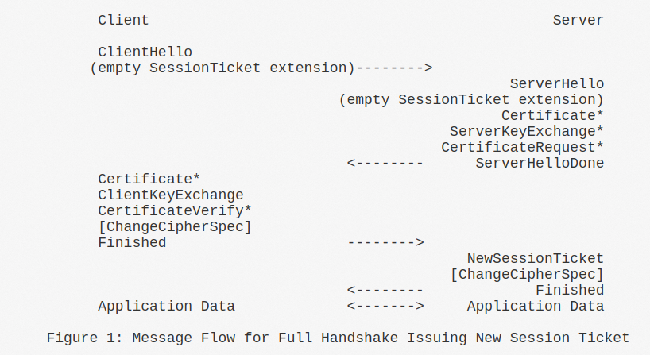

# Chapter 1 DTLS 1.2 Handshake

 与TLS 1.2相比，DTLS 1.2的handshake的不同在于：

1\) Server收到Client Hello之后，会发送一个Hello Verify Request\(这个消息的作用是为了应对DDoS攻击\)作为回应:

这个Hello Verify Request中携带Cookie信息：

2\) Client 收到Hello Verify Request之后，再次发送Client Hello并携带Cookie:

3\) 每个DTLS record的头部都会有Epoch和Sequence Number:

其中Sequence Number空间client side和server side是独立的。Epoch在Change Cipher Spec消息之后就会+1, 而且Sequence Number也会清零：

4\) DTLS增加了fragment Offset和Fragment Length来实现消息的分片和重组；

5\) DTLS server对于一个地址:端口对只能处理一条DTLS连接，不能同时处理两条及以上的连接。

